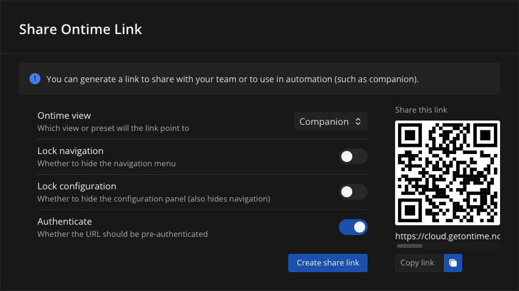

import { Image } from 'astro:assets';
import companion from '../../../assets/images/companion.png';
import sharelink from '../../../assets/screenshots/editor/settings/network__companion-link.png';

We maintain a [Companion module](https://bitfocus.io/connections/getontime-ontime) which allows you to integrate and control your Ontime app.

<Image src={companion} alt="Companion module" width={600} />

### Connecting to Ontime from Ontime's companion module

To connect companion to Ontime you will need to provide the module with an address to Ontime's server. \
This can be a IP address in your local network, localhost (if you are running everything in the same machine) or a URL for Ontime Cloud.

Ontime provides an interface to generate these links:
1. Navigate to `Editor` -> `Settings` -> `Sharing and reporting` -> `Share link`
2. Select `Companion` as `Ontime view`
3. If your stage is behind a password, activate the `Authenticate` toggle
4. Click the `Create share link` button which adds the address to your clipboard

5. Back to Companion, you can now insert the copied address in the `Ontime server address` field

:::tip[Help us improve]
Found a bug? \
Have an idea? \
Open a ticket in [the module repository](https://github.com/bitfocus/companion-module-getontime-ontime)
:::
