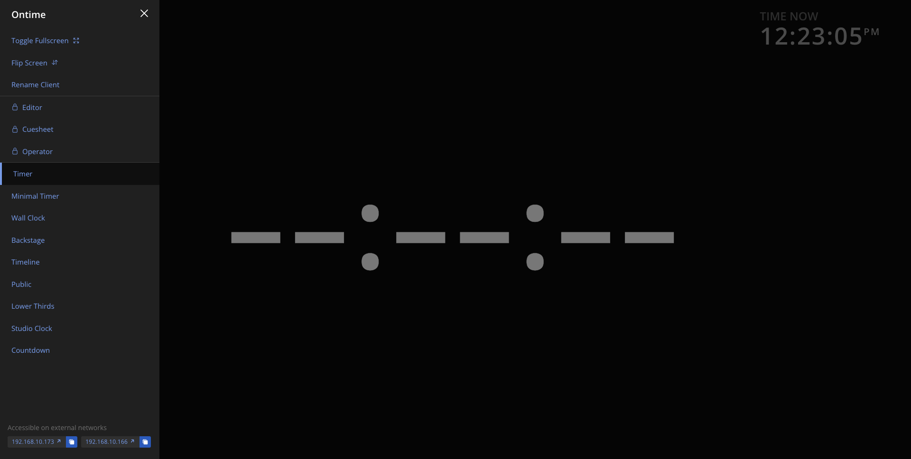

## Network availability
Ontime, is a server process.

Once Ontime is running, it will make itself available in all network interfaces to which the machine has access. \
These links can be shared with your team to allow any device that in the same network to access Ontime.

You can also use the IP address of the link for automation from other devices software.

:::caution
If you cannot reach Ontime from another device, please check your network configuration and firewall. \
There are no settings in Ontime other than the server port (by default 4001).

If you are running behind a **reverse proxy**, please check the configuration and make sure to allow passthrough for WebSockets.
:::

### Find interfaces in Settings
The Network settings `Editor` -> `Settings` -> `Network` contains the list of Network Interfaces where Ontime is available.

### Find interfaces in navigation
If you are using Ontime in the same machine as the app is running. \
You can find the external links to the view at the bottom of the navigation menu.

## Security
Note that Ontime discourages you from exposing the application in a public network. 

You can add a thin layer of protection over some views such as `/editor`, `/cuesheet` and `/op` using the **Pin Code** defined in the **General Settings**.

However, any device in your network can send commands to Ontime, which can alter its runtime. \
We recommend that **the most significant security control should happen at the network access level**.
