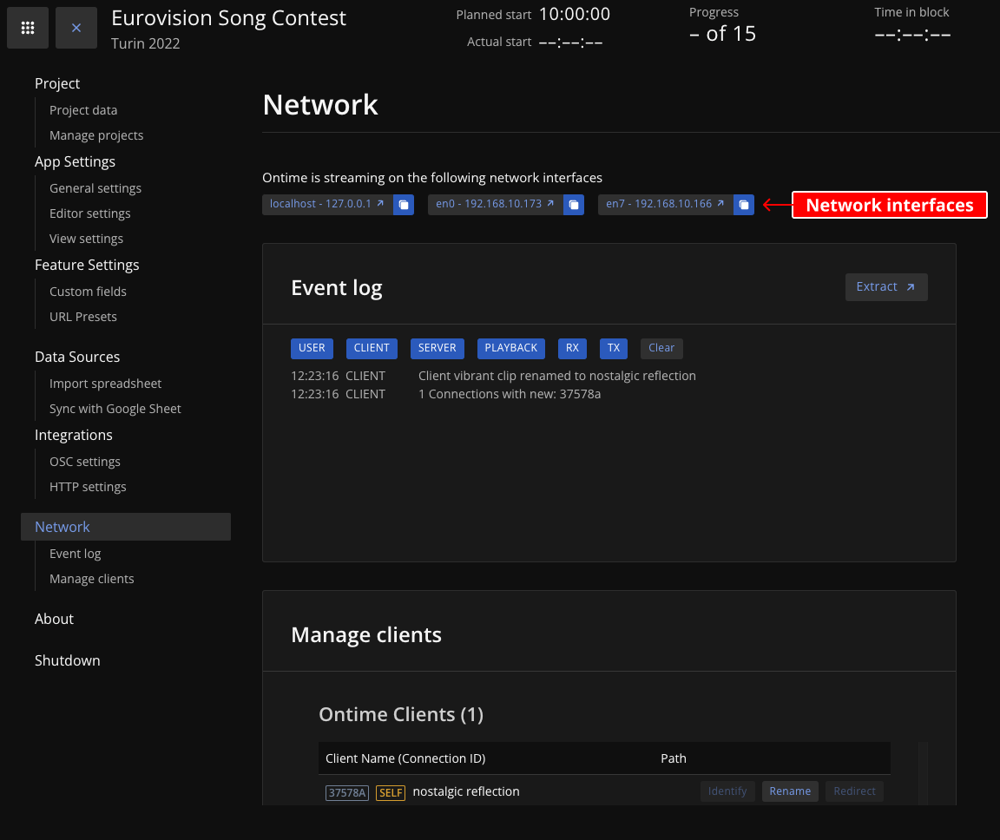

Once Ontime is running, it will make itself available in all network interfaces to which the machine has access. \
You can find the list of IP addresses in `Editor` -> `Settings` -> `Network`.

Use the device's web browser to navigate to the IP address of the computer running Ontime and point your automation to the same IP address.

:::note
You will find a list of network interfaces at the top of the network settings page; clicking on one of the blue links will open a browser pointing to that address. \
You can share any of these addresses with your team so that they can access Ontime views from any device in that network.
:::

:::caution
If you cannot reach Ontime from another device, please check your network configuration and firewall. \
There are no settings in Ontime other than the server port (by default 4001).

If you are running behind a **reverse proxy**, please check the configuration and make sure to allow passthrought for WebSockets.
:::

### Security
Note that Ontime discourages you from exposing the application in a public network. 

You can add a thin layer of protection over some views such as `/editor`, `/cuesheet` and `/op` using the **Pin Code** defined in the **App Settings**.

However, any device in your network can send commands to ontime, which can alter its runtime. \
We recommend that **the most significant security control should happen at the network access level**.
