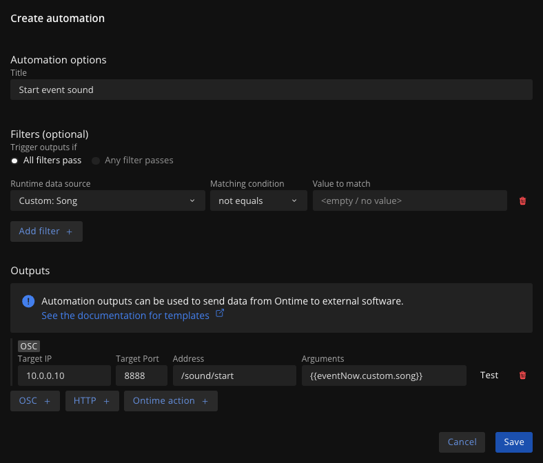
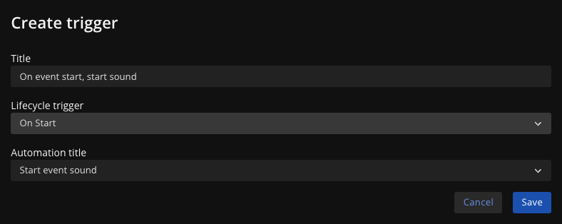

The Automation feature aims to integrate Ontime into users' workflows. \
Ontime has a large amount of production information, which users need considerable effort to maintain. We want to allow tools so that:

- allow distribution of Ontime's and other production data
- allow surfacing Ontime events
- allow synchronizing with other tools

The feature can be configured in the `Editor` -> `Settings` -> `Automation`

## Setting up automations in Ontime

The automations feature is split in two parts: [automation](#manage-automations) and [trigger](#manage-triggers).

### Manage automations
An automation entry contains **filter logic** and **outputs**. Ie: if these conditions are true, send these messages.


In the image example, we check if a custom field contains data (ie: is not empty), and if so, send an OSC message with its value.

:::note[HTTP, OSC and Ontime actions]
Aside from OSC, you can also automate the sending of HTTP messages and internal Ontime actions like manipulating the Auxiliary timer.
:::

### Manage triggers
Triggers associate the automation with the Ontime event lifecycle. \
We can describe, what action in Ontime should trigger which automation.


In the image example, we build on the previous automation to say: "when Ontime starts an event, trigger the automation that starts the sound".

### The Ontime lifecycle

While running your event, Ontime will go through a few lifecycle events.\
The automation feature allows you to request a message once that happens.

| Event                 | Description                                                        | 
| :-------------------- | :----------------------------------------------------------------- |
| `On Load`             | Triggered when an event is loaded                                  |
| `On Start`            | Triggered when an event starts                                     |
| `On Pause`            | Triggered when an event is paused                                  |
| `On Stop`             | Triggered when playback is stopped                                 |
| `On Every Second`     | Triggered once a second                                            |
| `On Update`           | Triggered once a second, as long as a timer is running             |
| `On Finish`           | Triggered when a timer passes the 0 mark                           |


### Using variables in automation outputs

You can embed data from the application runtime in the message using templates `/your-message/{{ontime-data}} {{ontime-more-data}}`

This means that any of the data described in the [Runtime Data](/api/data/runtime-data) can be sent as part of the message payload.

When the lifecycle event is triggered, Ontime places the updated piece of data in place of the template.

:::tip[Example]

You could compose a message that sends the index of the loaded event

```
/send-this/loaded-event-{{runtime.selectedEventIndex}}
```

:::note
The template inside the brackets need to reference the same shape as the nesting of the runtime data as described in [Runtime Data](/api/data/runtime-data). \
Use the  `.` when referencing a subkey

`{{titlesPublic.noteNext}}` \
`{{playback}}` \
`{{timer.current}}`
:::

### Finding variables
The entire [Runtime Data](/api/data/runtime-data) object is available in integrations using the above templates. \
However, it can be challenging to find the correct structure of the key.

You can see below a table with all the current keys available, this is likely to change as we develop Ontime and could get out-of-date. \
Continue reading here for how to find the variables yourself.

Keep in mind that your [custom fields](/features/custom-fields) will be added to the list. \
You can find the appropriate key in the Custom Fields panel.

:::note[Variables and Runtime data]
The Runtime data describes the state of your Runtime. 
As such, it will depend on your settings (eg. custom fields) and your playback (eg: are there events loaded) 

**Poll Ontime for the runtime data**
Load any event in Ontime, so that you can see a more complete object.

In your browser, poll Ontime by navigating to `http://<ip-address>:<port>/api/poll`
This will return a json object with the current state of the application.

From here, can **infer the variable** name by following the object. \
For example, given this portion of the payload:
```
payload {
    eventNow: {
        id: "1234"
    }
    eventNext: {
        custom: {
            vfx: "VFX3"
        }
    }
}
```
would become `{{eventNow.id}}` and `{{eventNext.custom.vfx}}`
:::

#### Runtime data
Note that this is just an example and it might run out of sync
Follow the steps above to find this for yourself

| Variable                        | Description                                                                 |
|---------------------------------|-----------------------------------------------------------------------------|
| `clock`                         | Current clock value in milliseconds                                         |
| `timer.addedTime`               | Additional time added to the timer in milliseconds                          |
| `timer.current`                 | Current timer value in milliseconds                                         |
| `timer.duration`                | Total duration of the timer in milliseconds                                 |
| `timer.elapsed`                 | Elapsed time in milliseconds                                                |
| `timer.expectedFinish`          | Expected finish time in milliseconds                                        |
| `timer.finishedAt`              | Time when the timer finished (null if not finished)                         |
| `timer.phase`                   | Current phase of the timer                                                  |
| `timer.playback`                | Playback state of the timer                                                 |
| `timer.secondaryTimer`          | Secondary timer value (null if not used)                                    |
| `timer.startedAt`               | Time when the timer started in milliseconds                                 |
| `onAir`                         | Boolean indicating whether the playback is active                           |
| `runtime.selectedEventIndex`    | Index of the selected event                                                 |
| `runtime.numEvents`             | Number of events                                                            |
| `runtime.offset`                | Offset time in milliseconds                                                 |
| `runtime.plannedStart`          | Planned start time in milliseconds                                          |
| `runtime.plannedEnd`            | Planned end time in milliseconds                                            |
| `runtime.actualStart`           | Actual start time in milliseconds                                           |
| `runtime.expectedEnd`           | Expected end time in milliseconds                                           |
| `eventNow.id`                   | ID of the current event                                                     |
| `eventNow.type`                 | Type of the current event                                                   |
| `eventNow.title`                | Title of the current event                                                  |
| `eventNow.timeStart`            | Start time of the current event in milliseconds                             |
| `eventNow.timeEnd`              | End time of the current event in milliseconds                               |
| `eventNow.duration`             | Duration of the current event in milliseconds                               |
| `eventNow.timeStrategy`         | Time strategy of the current event                                          |
| `eventNow.linkStart`            | Link start time of the current event (null if not used)                     |
| `eventNow.endAction`            | End action of the current event                                             |
| `eventNow.timerType`            | Timer type of the current event                                             |
| `eventNow.isPublic`             | Boolean indicating if the current event is public                           |
| `eventNow.skip`                 | Boolean indicating if the current event is skipped                          |
| `eventNow.note`                 | Note for the current event                                                  |
| `eventNow.colour`               | Colour code for the current event                                           |
| `eventNow.cue`                  | Cue for the current event                                                   |
| `eventNow.revision`             | Revision number of the current event                                        |
| `eventNow.timeWarning`          | Warning time for the current event in milliseconds                          |
| `eventNow.timeDanger`           | Danger time for the current event in milliseconds                           |
| `eventNow.custom.song`          | Custom field: song for the current event                                    |
| `eventNow.custom.artist`        | Custom field: artist for the current event                                  |
| `currentBlock.block`            | Current block (null if not used)                                            |
| `currentBlock.startedAt`        | Start time of the current block (null if not used)                          |
| `eventNext.id`                  | ID of the next event                                                        |
| `eventNext.type`                | Type of the next event                                                      |
| `eventNext.title`               | Title of the next event                                                     |
| `eventNext.timeStart`           | Start time of the next event in milliseconds                                |
| `eventNext.timeEnd`             | End time of the next event in milliseconds                                  |
| `eventNext.duration`            | Duration of the next event in milliseconds                                  |
| `eventNext.timeStrategy`        | Time strategy of the next event                                             |
| `eventNext.linkStart`           | Link start time of the next event (null if not used)                        |
| `eventNext.endAction`           | End action of the next event                                                |
| `eventNext.timerType`           | Timer type of the next event                                                |
| `eventNext.isPublic`            | Boolean indicating if the next event is public                              |
| `eventNext.skip`                | Boolean indicating if the next event is skipped                             |
| `eventNext.note`                | Note for the next event                                                     |
| `eventNext.colour`              | Colour code for the next event                                              |
| `eventNext.cue`                 | Cue for the next event                                                      |
| `eventNext.revision`            | Revision number of the next event                                           |
| `eventNext.timeWarning`         | Warning time for the next event in milliseconds                             |
| `eventNext.timeDanger`          | Danger time for the next event in milliseconds                              |
| `eventNext.custom.song`         | Custom field: song for the next event                                       |
| `eventNext.custom.artist`       | Custom field: artist for the next event                                     |
| `eventNext.delay`               | Delay for the next event in milliseconds                                    |
| `auxtimer1.duration`            | Duration of the auxiliary timer in milliseconds                             |
| `auxtimer1.current`             | Current value of the auxiliary timer in milliseconds                        |
| `auxtimer1.playback`            | Playback state of the auxiliary timer                                       |
| `auxtimer1.direction`           | Direction of the auxiliary timer                                            |

### Human readable data

The above data defined in runtime data will give you the data from Ontime as consumed in-app.\
For example, all times are in milliseconds.

This is great for software-to-software communications, but it might not be ideal if you want to consume the data yourself.

For these use cases, we have defined a small list of human-readable timer values you can use in your integration messages.\
The usage would look like

| Variable             | Usage                      | Result                                                                |
| :------------------- | :------------------------- | :-------------------------------------------------------------------- |
| `human.clock`        | `{{human.clock}}`          | Current clock in `hh:mm:ss`                                           |
| `human.duration`     | `{{human.duration}}`       | Duration of current timer in  `hh:mm:ss`\*                            |
| `human.expectedEnd`  | `{{human.expectedEnd}}`    | Time at which the current event is expected to finish in `hh:mm:ss`\* |
| `human.runningTimer` | `{{human.runningTimer}}`   | Current running timer in `hh:mm:ss`\*                                 |
| `human.elapsedTime`  | `{{human.elapsedTime}}`    | Elapsed time of current timer in `hh:mm:ss`\*                         |
| `human.startedAt`    | `{{human.startedAt}}`      | Time when the current time started `hh:mm:ss`\*                       |

:::note
\* Timer values will return "null" if no event is loaded
:::
