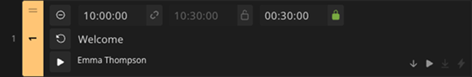
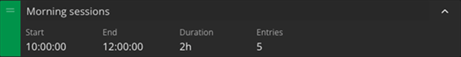

Ontime allows users to provide a Rundown (or schedule) of events. \
The app then infers a sequence of timers from this schedule and can advise show runners / stage managers / operators on deviations to schedule.

:::note[What is a rundown?]
On Ontime's context, "Rundown" is a typical broadcast term for a schedule, ie: an ordered list of content and their timing.

It is used for pre-planning (ensuring we have the right amount of content to fit the allocated time) and, in Ontime's case, leveraged at runtime to keep the show schedule on track.
:::

## Creating rundowns in Ontime

The primary interface for creating rundowns is the [Editor](/interface/production/app-editor/) view, which is presented when you start Ontime.

The Editor will later provide runtime control over the rundown, but for planning time you will have the tooling here to quickly generate rundowns allowing for operations such as reordering, cloning, skipping events...

:::tip[I just want some stage timers]
Ontime is excellent at scaling from simple to complex use cases. \
If you all you are looking for in Ontime is to provide stage timers, you likely do not need the advanced rundown offset and metadata.

You are welcome to create a list of events with your needed timers (eg: 1min, 5min, 10min) and save the rest of Ontime's features for another time.
:::

## Timers and metadata entries

Ontime offers two main types of entries to populate your rundown.

**Timer events** and **metadata events**. In short:

**Timer events** create timers that Ontime can generate countdowns to \
**Metadata events** allow detailing the rundown with data that does not generate timers

### Events

TLDR; Events are individual show segments: a speaker presentation, video playback, or musical performance.

Events are rundown entries which can generate timers. \
Ontime can play an event and generate the relevant confidence monitor / stage timer views.

We can also leverage the total duration of events to provide information on the rundown and group total duration and schedule.

See more information on [our quick tips for time entry](/quick-tips/smart-time-entry/).

### Groups

TLDR; Groups help organize related content: all speakers in a panel, or all scenes in Act 1.

Groups are a metadata event that allows grouping several entries. \
Groups entries do not have their own schedule but inherit the schedule from the contents.

You can leverage groups to segment your rundown and to allow quick move and clone operations on a list of entries.

Ontime can also create extra metadata timers such as planned and expected times to group end.

### Milestones

TLDR; Milestones add operator notes: give fireworks standby, check change-over progress.

Milestones are note entries in the rundown.

These allow inserting operator notes or data into the rundown notes. \
Milestones do not have a schedule and do not show up in the schedule views (ie: backstage).

## Delays and delay flows

The delay entry is part of Ontime's delay management system.

In Ontime, delays entries can be used to communicate schedule changes to your team.\
Delays act as an overlay over the schedule are clearly indicated in all views. \
[Read more](/quick-tips/managing-delays/).

## Sharing the rundown

As the show runner / Ontime operator, we expect that you will be at home in the [Editor](/interface/production/app-editor/) view.

However, Ontime is more useful as a collaboration tool for your team.

The [Cuesheet](/interface/production/cuesheet/) and [Operator](/interface/production/operator/) views are made for realtime collaboration with your team. \
Once you have created the rundown, you can share a link to Ontime to allow others to see the rundown and contribute with their department data.

### Exporting

If instead you are looking to export the rundown, either to print or archive, please consider using the [Excel export](/quick-tips/import-export/) or the [Google Sheet](/features/import-spreadsheet-gsheet/) features.

Ontime does not currently have a in-app printing feature.\
The best way to achieve this is by exporting the rundown to an Excel file and styling and printing as you need.