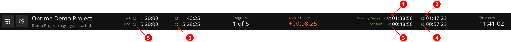

Users create the rundown in a pre-production phase, where Ontime can extract schedules and total durations.

At runtime, Ontime overlays the playback over the schedule to provide extra information on the rundown progress. \
In short, we can use the schedule and the current playback to answer questions like:

- how long until "event-x" starts?
- are we running late?

## Expected times and planned times

With these layers of information, Ontime can extract two types of schedule, **planned times** and **expected times**:

**Planned times** would tell you when is your event supposed to start, according to the schedule you have provided \
**Expected times** give an expectation of when Ontime expects the event is able to start. The expected time is calculated using the current offset + the total duration of all upcoming events until that point.

Considering the above screenshot of the Editor overview.

**Countdown to group end**

1
 Time until the **planned end** of the Morning session group \

2
 Time until the **expected end** of the Morning session group

**Countdown to flag**

3
 Time until the **planned end** of the Session 1 flag event \

4
 Time until the **expected end** of the Session 1 flag event

**End of rundown**

5
 Rundown **planned end** time \

6
 Rundown **expected end** time

## Time to anything

With the information of expected and planned times, Ontime can provide an timer to any rundown event.

See more the [delay management documentation](/quick-tips/managing-delays/).
