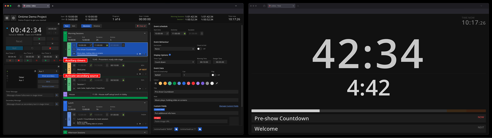

The Auxiliary timer is a feature that allows parallel, free-running clocks alongside the rundown playback. \
These timers do not affect the rundown but serve as an interface for tracking arbitrary events. For example: 
- how long is a particular section
- countdown to a media playback end time

### Controlling the auxiliary timer
The Auxiliary timer can be controlled in the [Editor interface](/interface/production/app-editor/) or through one of the APIs (follow docs for [HTTP](/api/protocols/http/#auxiliary-timer), [OSC](/api/protocols/osc/#auxiliary-timer) or [WebSockets](/api/protocols/websockets/#auxiliary-timer)).

### Display the auxiliary timer in the stage timer view
Additionally, you can display the secondary timer as a secondary field in the [stage timer view](/interface/automated/stage-timer/). 

This can be done in the [Editor interface](/interface/production/app-editor/) or through one of the APIs (follow docs for [HTTP](/api/protocols/http/#example-secondary-source-in-the-stage-timer-view), [OSC](/api/protocols/osc/#example-secondary-source-in-the-stage-timer-view) or [WebSockets](/api/protocols/websockets/#example-secondary-source-in-the-stage-timer-view)). 
