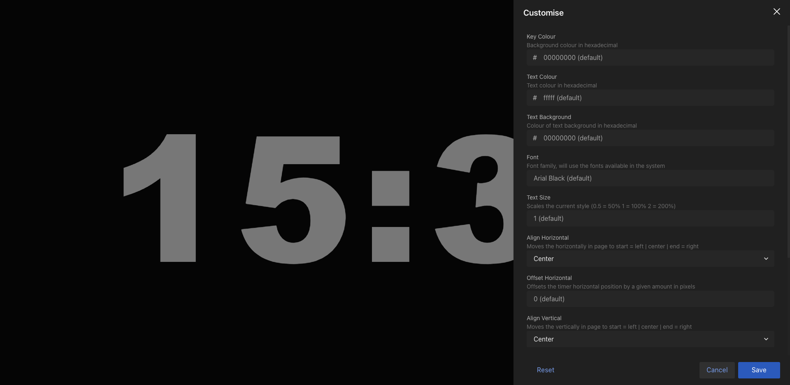

Views meant for signage or data consumption are configurable using URL parameters.

This means you can share a link which includes the complete customisation of a view, and it pairs great with the [URL Presets feature](/features/url-presets).

You can open the customisation panel in any supported view via the View Parameters Editor (shown in the image) opened using the Pencil button in the interface.
