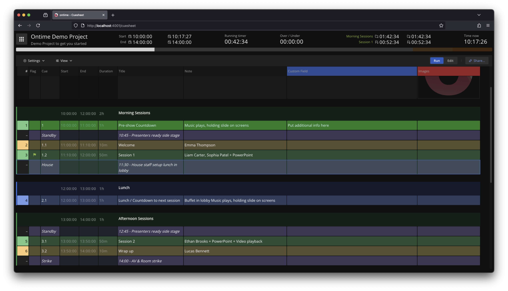

Custom fields allow adding your data to any event in the rundown.

This is an excellent way to have operator or department-specific data in your rundown (eg, light, sound, camera). \
It empowers collaboration at runtime with the [operator](/interface/production/operator) and [cuesheet](/interface/production/cuesheet) views.

:::note
The fields are created in the `Editor` -> `Settings` -> `Project settings` -> `Custom fields`. \
Once created they can are available in the editor and cuesheet views.
:::
