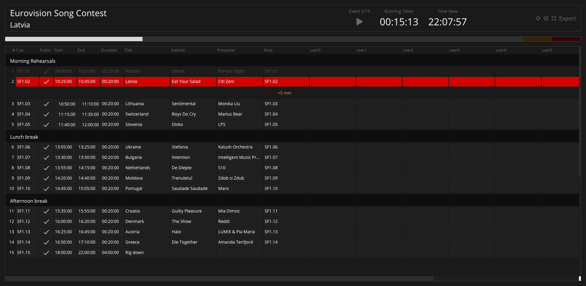

Custom fields allow adding your data to any event in the rundown. This data is available in some of the views and is, otherwise, not used by Ontime.

This is an excellent way to have operator or department-specific data in your rundown (eg, light, sound, camera). \
It empowers collaboration at runtime with the [operator](/views/operator) and [cuesheet](/views/cuesheet) views.

:::note
The fields are created in the `Editor -> Settings -> Project settings -> Customm fields`. \
Once created they can are available in the editor and cuesheet views.
:::
