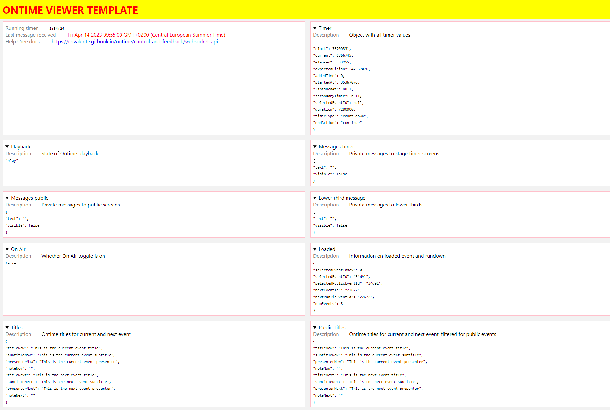

Ontime broadcasts its data in the network to be used by any device.

You can leverage this to create custom views and control interfaces while letting Ontime handle the distribution and time-keeping.

:::tip[Show me the code!]
You can find a demo template using Javascript and HTML on the [viewer template repo](https://github.com/cpvalente/Ontime-viewer-template-v2) in GitHub.
:::
