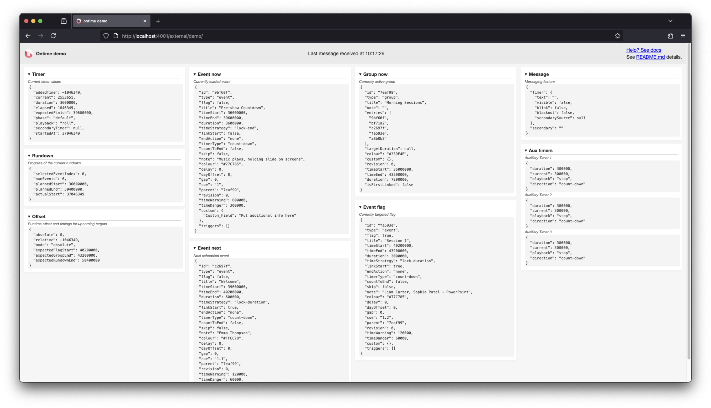

import { FileTree } from '@astrojs/starlight/components';

Ontime broadcasts its data in the network for use by any device.

You can leverage this to create custom views and control interfaces that match your needs while letting Ontime handle the distribution and time-keeping.

## Making custom views
You can create a custom view using any technology of your choice. If you plan to deploy this using Ontime's infrastructure, you must leverage Javascript, CSS and HTML.

In short, you will create a web page / application that listens to the WebSocket stream from Ontime and updates its view. 

You can use Ontime's demo page to get started. It contains a well documented demo with explanation on how to connect and datasets.

```bash
https://cloud.getontime.no/my-stage/external/demo
```



You can find [the code from the demo here](https://github.com/cpvalente/ontime/tree/master/apps/server/src/external/demo).
Please follow here for the [documentation on the Runtime Data](/api/data/runtime-data). \
If you are also looking to control Ontime, you can find the needed information in the [API documentation](/api/protocols/websockets).

Alternatively, the [APIs](/api) also offer polling endpoints which can be helpful in cases where you are unable to utilise the WebSocket stream.

## Delivering custom views
Once you have created your custom Ontime views, you can use Ontime's infrastructure to deliver these in the network. 

Ontime exposes any file inside its external folder to the network. \
In the example of this folder directory, the demo interface would be available at `http://<ip-address:port>/external/demo`.

<FileTree>
- external
  - demo
    - index.html
    - styles.css
    - app.js
</FileTree>

To simplify the process, we already include a demo interface that demonstrates the usage.
