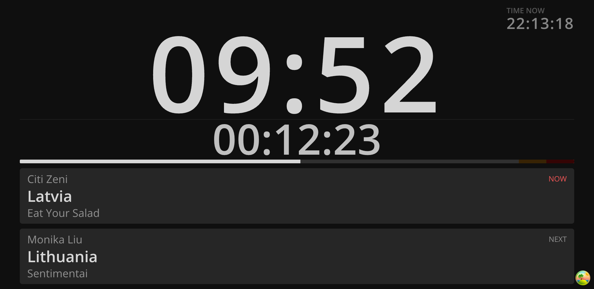

You can inject data into Ontime's presenter view. \
This is useful in cases where you would like another software to push some data to Ontime, ie: a running time from your video playback software.

## Setting external message

The External message is meant for other applications to share data with Ontime. \
As such it cannot be set within Ontime, you will need to use one of the APIs to do so.

See the documentation on setting the external message using the [OSC](/api/protocols/osc/#example-change-the-external-message-text) or [WebSocket API](/api/protocols/websockets/#example-change-the-external-message-text).

## Message preview
In the `editor` view, you can see the current value and visibility of the external data in the message panel, along with the `Timer message`.
