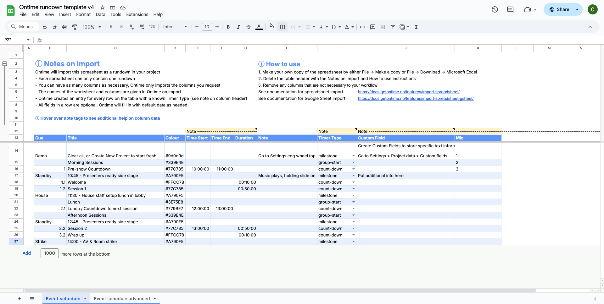

You can synchronise Ontime to a Google Sheet. \
This is ideal for collaboration or extensive data manipulation.

Follow [here](https://www.google.com/url?q=https://docs.google.com/spreadsheets/d/1Ft5czgMtXAuwdU5X4sxXoNQKan-dR4n1AU3vIN8TSCg/edit?usp%3Dsharing&source=gmail-imap&ust=1713612121000000&usg=AOvVaw3hFUgmiTbeN9-J6KUBmmVa) to see the Google Sheet from the screenshot

To enable this feature, you will need provide Ontime with the necessary permissions.\ 
From there, we can read and write to the Google Sheet spreadsheet.

### Step 1 - Upload client secret

You will need to create a token in your Google Account and upload it to Ontime
https://console.cloud.google.com \
This process is similar to the one used by the Companion app

:::tip[Create token in Google Cloud Console]
This guide is copied from the Google documentation at https://console.cloud.google.com
- On the __Google Cloud Console__, __Create a Project__, and in the `APIs and services > Enabled APIs and servers`, make sure you enable the __Google Sheets API__.
- Go to https://console.cloud.google.com/apis/credentials, click `Create Credentials`, and select `OAuth client ID`.
- Select `Web Application` as the `Application Type`, and give the app a name.
- In the `Authorised redirect URIs` section, add a redirect to the localhost URL `http://localhost`.
- Download the file with the Client ID and upload it in the Ontime interface.
:::

### Step 2 - Authenticate

Once we have the Client ID token Ontime can request Google permission to access the data in the spreadsheet.  

For your security, the authentication is kept in memory and wiped when Ontime quits.\
This means that you would need to re-authenticate every time you start Ontime.

### Step 3 - Add Document ID

You will need to provide Ontime with the ID of the document to import.

The Document ID is available in the URL after the `d`, such as 
`https://docs.google.com/spreadsheets/d/<Document ID>/edit#gid=0`

Click the `Connect` button to establish a connection and get the worksheet options.

### Step 4 - Select the worksheet

Once connected, the dropdown will populate with a list of worksheets available in the document.

Select the one with your rundown.

### Step 5 - Upload / Download at will

Now Ontime is connected to your Google Sheet document.

You can get the data from your Google Sheet into Ontime by pressing the `Download` button anytime.

You can also push your local data from Ontime to the Google Sheet by clicking the `Upload` button.
