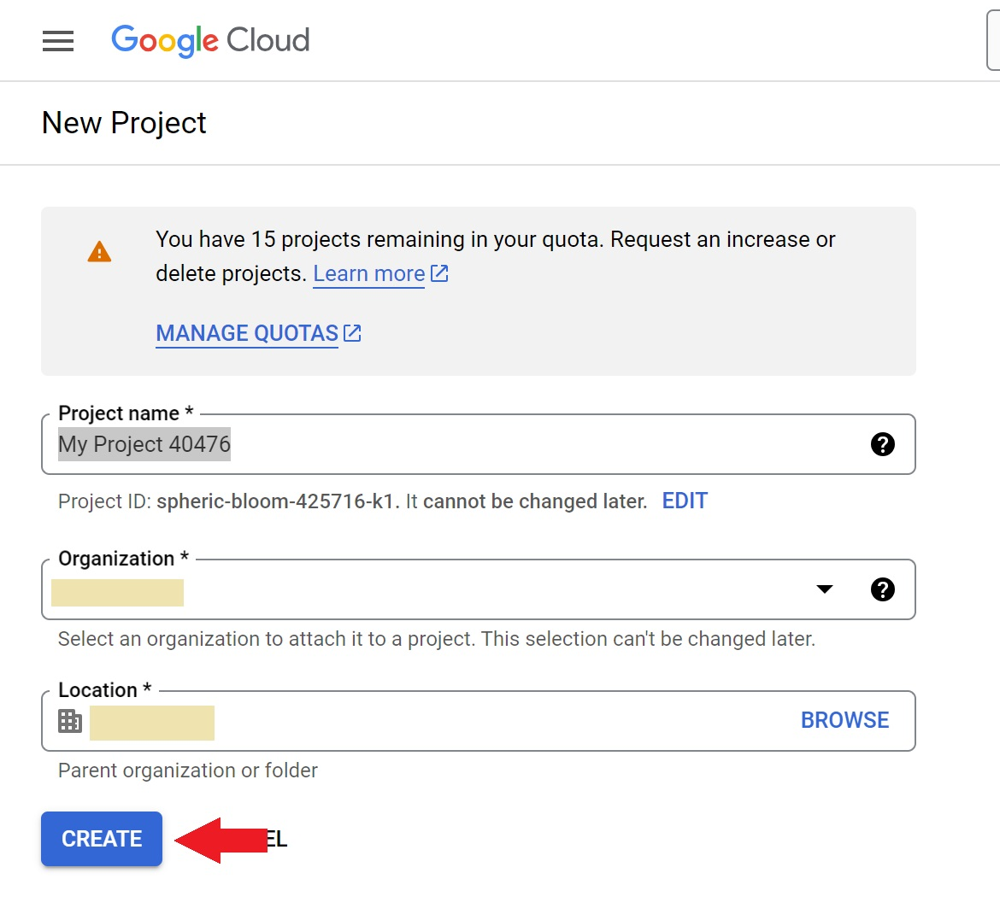
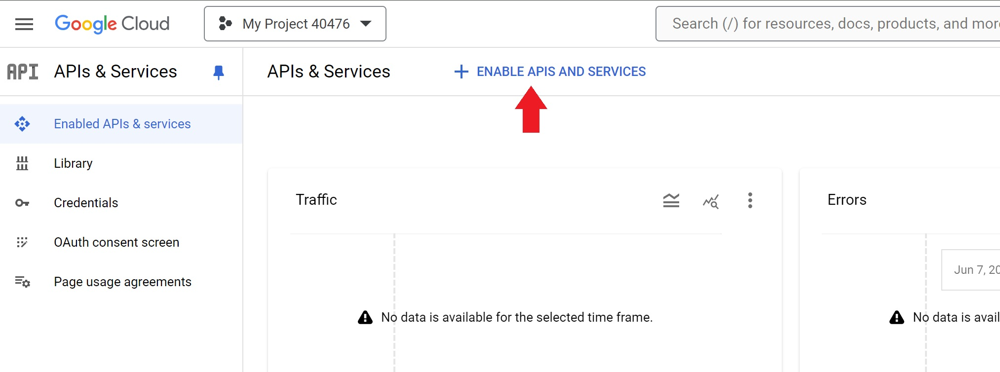
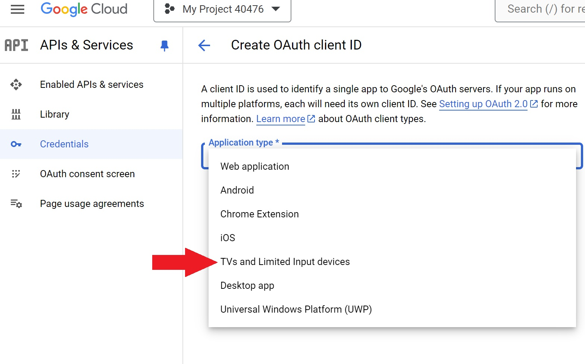

import { Steps } from '@astrojs/starlight/components';

[spreadsheet-link]: https://docs.google.com/spreadsheets/d/1zT6yRgQUaICEiAFR85VEL-E9hAUDujKg6DaWR0iDYmY

You can synchronise Ontime to a Google Sheet. \
This is ideal for collaboration or extensive data manipulation.

Follow [here][spreadsheet-link] to see the Google Sheet from the screenshot
To enable this feature, you will to need provide Ontime with the necessary permissions.\
From there, we can read and write to the Google Sheet spreadsheet.

:::note[Prerequisites]
To use the Google Sheet integration, you will a Google account and to the Google Console. \
The machine running Ontime must have access to the internet.
:::

<Steps>
  <ol>
    <li>
      ### Create project
      

        
Go to https://console.cloud.google.com/ and create a new project

        
        
        
      

      

        
On the front page select the newly created project

        
        
      

    </li>
    <li>
      ### Enable the Sheet API
      

        
Click enable APIs and Services

        
      

   
      

        
... and search for Sheets

        
        
        
      

    </li>
    <li>
      ### Setup consent screen
      

        
Back on the APIs and Services to set up a OAuth consent screen

        
      

      

        
Add necessary scopes

        The first step depends very much on how your organization is set up but it should make sense by reading through the options
        If you are unsure select external and only fill out the required fields

        When thats done click "ADD OR REMOVE SCOPES"

        
      

      
      

        
Filter for sheets, add "/auth/spreadsheets" and click update

        
        
      

      

        
Click save and continue

        For "Test users" add the email(s) the will be using this. \
        Save and go back to the dashboard
      

    </li>
    <li>
      ### Create credentials
      

        
Go to Credentials

        
      

   
      

        
Click Create Credentials and select OAuth client ID

        
        
      

      

        
For Application type select TVs and Limited input device, give it a name and click create

        
      

      

        
Download the result, we are now done with the Google console

        
      

    </li>
    <li>
      ### Connect Ontime
      

        
Go to the sheet sync settings

        
        
        
      

      

        
Upload the file we have downloaded from Google console

        
      

      

        
Get the sheet ID, paste it in Ontime and click connect

        
        
      

      

        
Copy the code and click authenticate and follow the instructions from Google

        
      

    </li>
  </ol>
</Steps>
