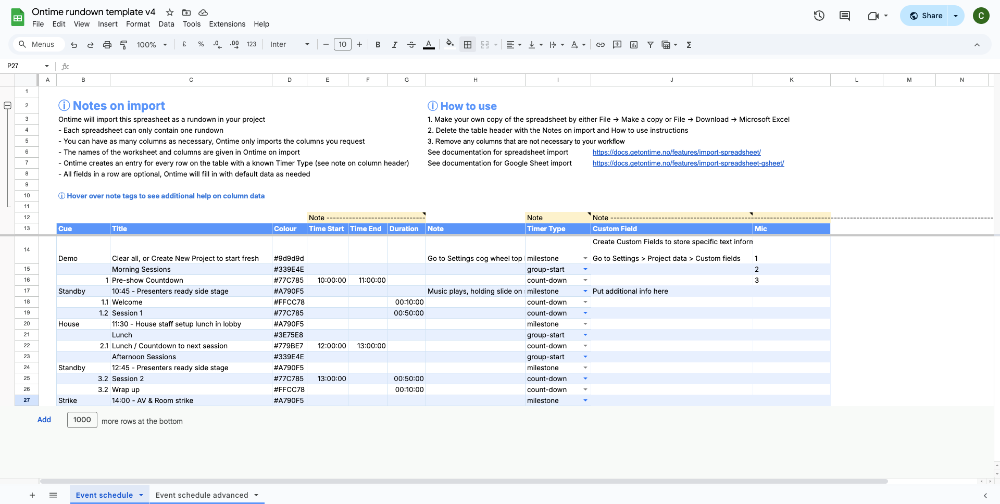

[spreadsheet-link]: https://docs.google.com/spreadsheets/d/1zT6yRgQUaICEiAFR85VEL-E9hAUDujKg6DaWR0iDYmY
[css-colour]: https://developer.mozilla.org/en-US/docs/Web/CSS/named-color

Ontime allows you to import rundown data from spreadsheets such as Excel or Google Sheets. \
This is typically used when a rundown is prepared externally and then brought into Ontime for live execution.

Follow [here][spreadsheet-link] to see the Google Sheet template in the screenshot.

:::tip[Google Sheets]
Maybe you are trying to import data from Google Sheets?

The data structure is exactly the same and the documentation below relevant, but some extra steps are needed to authenticate Ontime with Google. \
See the [guide](/features/import-spreadsheet-gsheet)
:::

## How spreadsheet import works

When importing a spreadsheet:

- Each row is interpreted as a rundown item
- Columns are mapped to Ontime fields (e.g. title, duration, notes)
- The data is validated before being added to the rundown
- A preview is generated to allow verification before import

After uploading a supported file, Ontime guides you through column mapping and preview before confirming the import.

The preview is an important step which allows you to be comfident on what data is imported and resolve any issues with formatting or mapping. \
The import is only applied after confirmation.

## Spreadsheet format

Ontime expects a structured table format.

- Each row represents a single rundown item (you can override this behaviour, see Timer type notes below)
- Empty rows may be ignored or skipped
- Times can either be an Excel time field or a short text as described in the [in the smart entry feature](/quick-tips/smart-time-entry), eg: 00:10:15 or 10m15s

See below the expected data types of the rundown data

Note: Field names are not case-sensitive: both `Title` and `title` would be recognised on import.

| Event Field    | Data Type                                                                             | Default value |
| :------------- | :------------------------------------------------------------------------------------ | :------------ |
| Start          | Excel time \| [string](/quick-tips/smart-time-entry)                                  | 00:00:00      |
| Link start     | boolean                                                                               | false         |
| End            | Excel time \| [string](/quick-tips/smart-time-entry)                                  | 00:00:00      |
| Duration       | Excel time \| [string](/quick-tips/smart-time-entry)                                  | 00:00:00      |
| Cue            | string                                                                                | ""            |
| Title          | string                                                                                | ""            |
| Skip           | boolean                                                                               | false         |
| Note           | string                                                                                | ""            |
| Colour         | string (# hex colour or [named css colour][css-colour])                               | ""            |
| End action     | `none` `load-next` `play-next`                                                        | `none`        |
| Timer type\*   | `count-down` `count-up` `clock` `block` `skip` `group` `group-end` `milestone` `none` | `count-down`  |
| Count to end\* | boolean                                                                               | false         |
| Time warning   | Excel time \| [string](/quick-tips/smart-time-entry)                                  | 00:02:00      |
| Time danger    | Excel time \| [string](/quick-tips/smart-time-entry)                                  | 00:01:00      |

:::note[Timer type and skipping import]
The **Timer type** column extends the possible values for timers.

Where a timer count type can be `count-down` `count-up` `clock` `count-down`. \
Adding a value `block` to this field, creates a Block event.

Any value added here that is not one of the above (eg: `skip` or `production`), will prompt Ontime to skip importing this row.
:::

:::note[Count to end]
The count to end property can be used to tell Ontime that this event should always count to its scheduled end, regardless of its start time.
:::

### Custom Fields

Ontime allows importing any amount of [custom fields](/features/custom-fields). \
You will need to provide the title of the relevant columns on import.

For each field provided, Ontime will create a custom field and add the data in the excel table row to the event.
