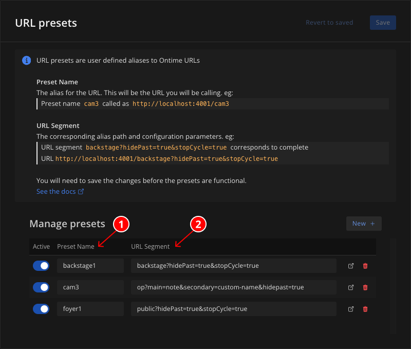

URL presets are user defined aliases (shortcuts) to Ontime URLs.

The configuration for URL Presets is done centrally from the Editor settings at `Editor` -> `Feature Settings` -> `URL Presets`. \
This means that these can be changed for all users accessing Ontime from one place, without changes necessary in the other devices.

The feature serves two primary purposes:

### Providing dynamic URLs for automation or unattended screens
Consider the case of fixed devices, unattended screens or hardware integrations, where access to change the browser URL may be impractical. \
Any changes to the aliases will be automatically reflected in the devices that are pointed at that URL.

### Managing complex view configurations
We may have specific configurations for operator views or utility screens that we want to manage centrally. \
See example below:

:::tip[Aliases example]
Consider a camera operator that needs an Ontime view with a specific configuration. \
We have configured the view as necessary and it resolves to the following URL:
`http://localhost:4001/op?main=note&secondary=custom-name&hidepast=true`

We may want to manage the configuration in Ontime, so that the camera operator can access the already configured view without needing to concern about the view options.
This is a typical use case for URL Presets.

To achieve this we would need the following steps:

1. Open the relevant view and configure using the [available configuration options](/quick-tips/configuring-views)  
2. Once configured, copy the view result URL and navigate to `Editor` -> `Sharing and reporting` -> `URL Presets` create a **New Preset**
3. Give Ontime an alias for the URL (eg: cam3) and paste the link in the `Paste URL` input
4. Click **Generate** and **Save** to make the new preset and save it

From here, anyone that accesses Ontime on the URL `http://localhost:4001/cam3` will be redirected to configured link.
:::

