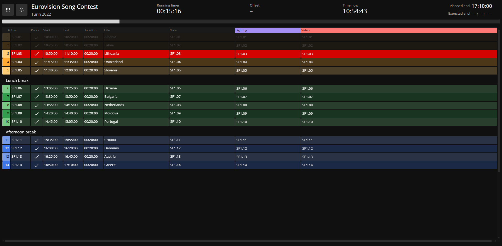

User fields is a feature which allows adding custom user data to any event in the rundown. \
Ontime does not use these fields; they can be labelled and contained as appropriate for your use case (eg, light, sound, camera).

This is an excellent way to have operator or department-specific data in your rundown. \
It empowers collaboration and runtime with the [operator](add-link) and [cuesheet](add-link) views.

:::note
There are ten available fields (user0 - user9). \
The fields' names are configurable in the Editor's [cuesheet settings](add-link).
:::
