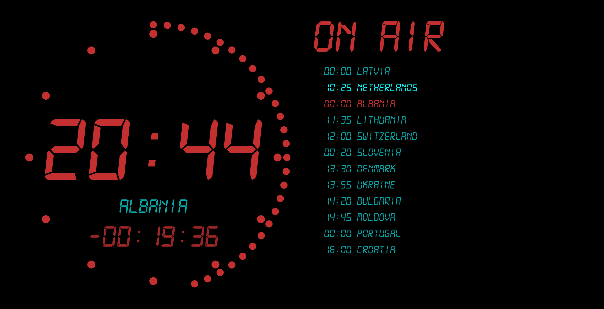

```bash title="Studio Clock"
https://MY-IP-ADDRESS:4001/studio           
```

Inspired by a studio master clock, the `Studio Clock` displays current time along with running timer and a summary of the schedule.

:::note[On Air]
The **On Air** state is an automated value which indicates whether the playback is currently active.
:::


