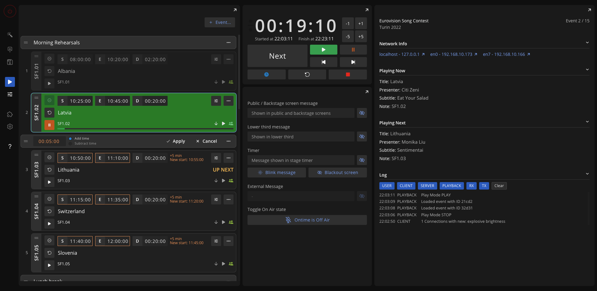

```bash title="Editor"
https://MY-IP-ADDRESS:4001/editor           
```

The `Editor` view is the main application view. \
The main purpose of this view is data entry and show running.

Here, you will also find the application settings.


