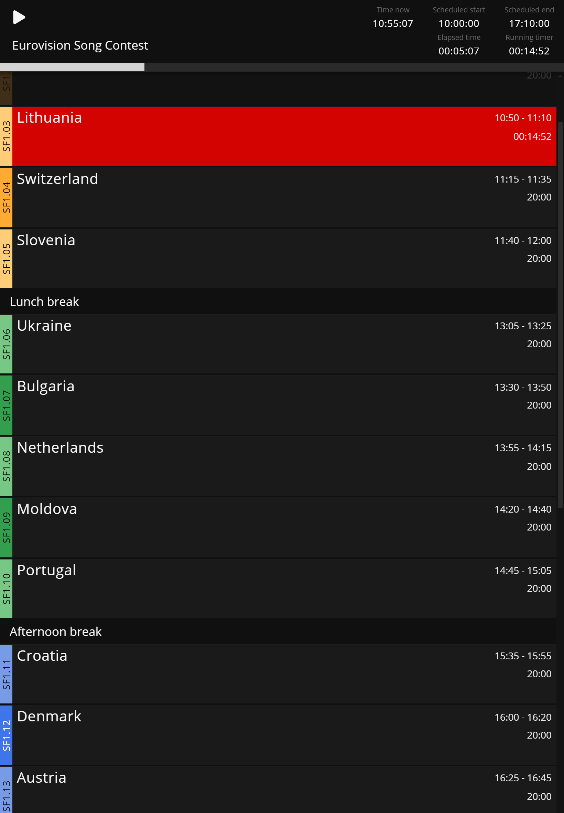

```bash title="Operator View"
https://MY-IP-ADDRESS:4001/op           
```

The `Operator` allows following the runtime playback while subscribing to notes from a particular [custom field](/features/custom-fields).

This view is made for busy operators, and while it allows for editing of fields, it is completely automated at runtime. \
The operator view us designed for devices such as phones and tablets.


