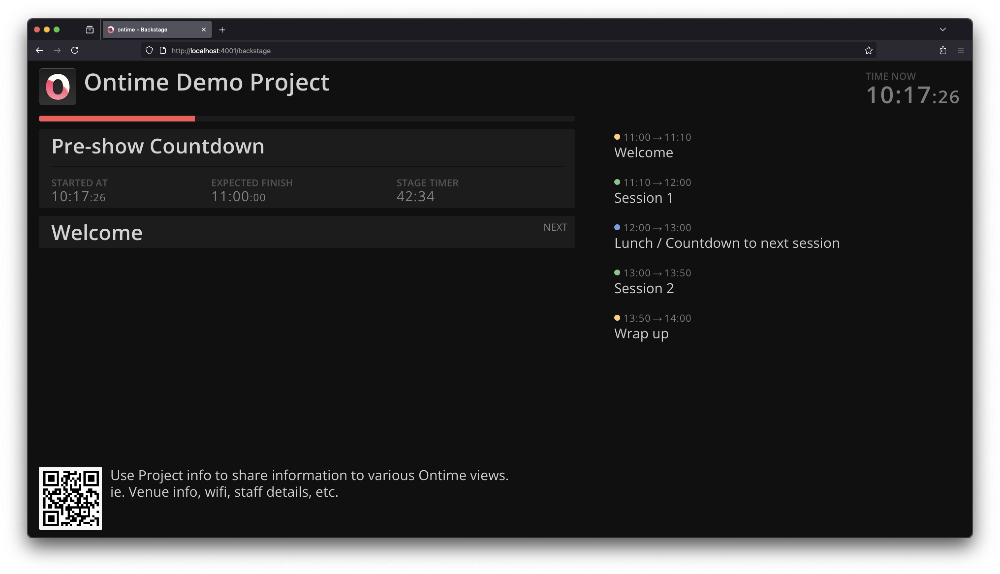

```bash title="Backstage"
https://cloud.getontime.no/my-stage/backstage           
```

The <mark>Backstage</mark> view shows a summary of the running timer along with the rundown schedule.

This would be a typical backstage screen, which aims to provide your production team an easy-to-follow overview of the event progress.


