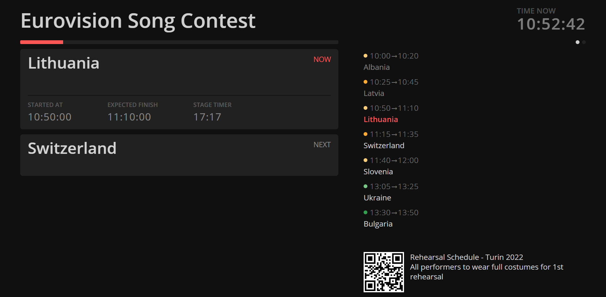

```bash title="Backstage / Stage Manager View"
https://MY-IP-ADDRESS:4001/backstage           
```

The `Backstage` view shows a summary of the running timer along with the remaining schedule.

As a backstage view, delays are shown so that you can communicate these to your team.


