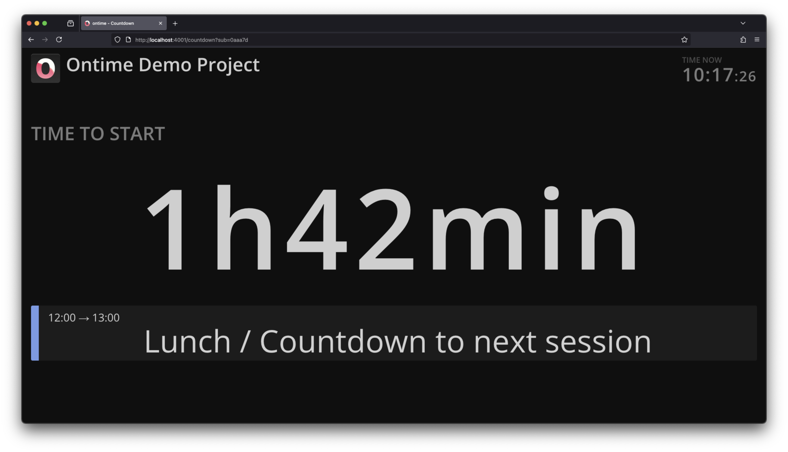
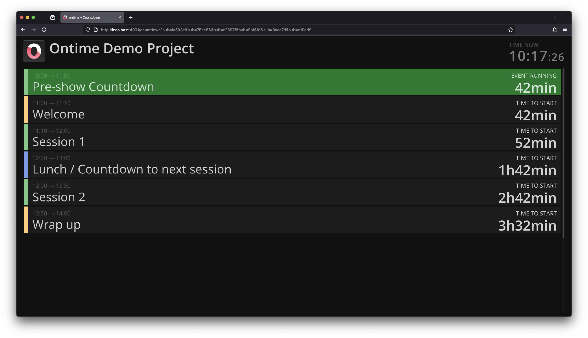

```bash title="Countdown"
https://cloud.getontime.no/my-stage/countdown           
```

The <mark>Countdown</mark> view allows you to create countdowns to a custom selection of scheduled events.

It aims to solve the case where you need to track the time or progress of a particular selection of events.  \
eg: Hospitality tracking the scheduled breaks, or an actor following time to their scene. No other times are relevant.



