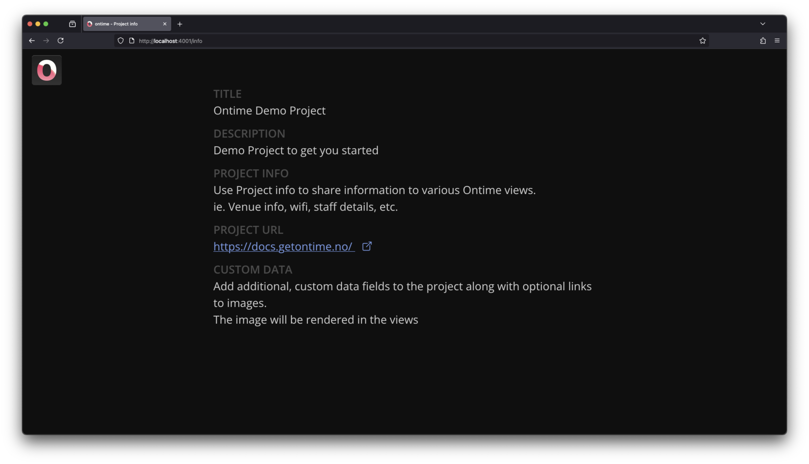

```bash title="Project info"
https://cloud.getontime.no/my-stage/info           
```

The <mark>Project info</mark> view is a simple page that gives an overview of the current project data. \
This is a good place for your crew to get contact lists and information that relates to the project and not to the rundown.


