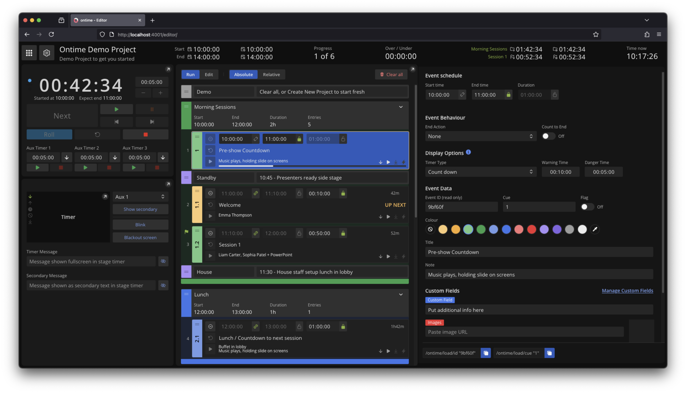

```bash title="Timer"
https://cloud.getontime.no/my-stage/timer           
```

The <mark>Stage Timer</mark> is probably what you came here for.

The typical confidence monitor used on stage, it displays a running timer for the current speaker. \
It also contains information on current and next events.



From the editor view, you can customise what is displayed in the Stage Timer, including secondary data from [external sources](/features/external-message), messages or [Auxiliary timers](/features/aux-timer). \
These features are useful to give extra information to the presenter, such as data from another software eg: video progress, or a countdown to another event.
