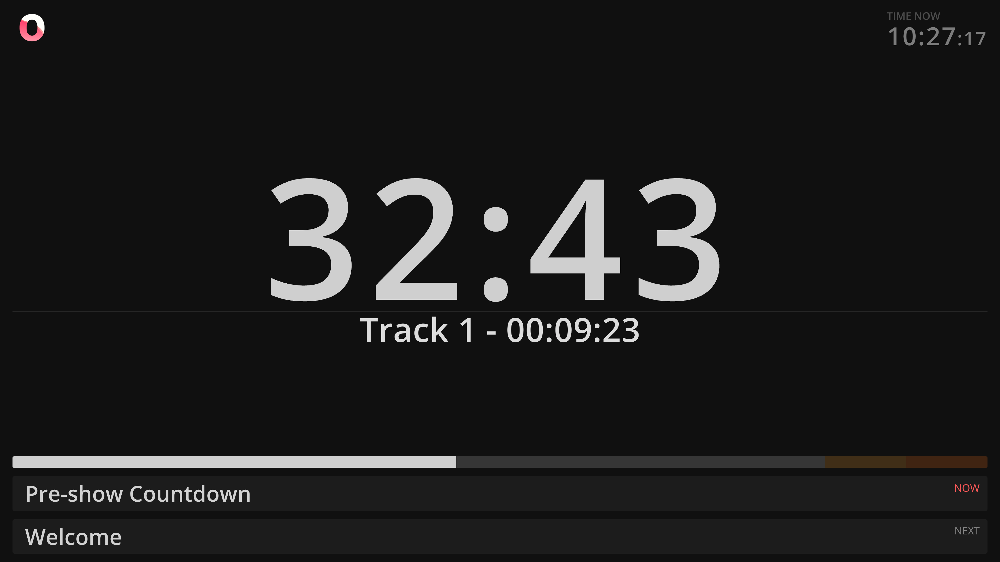

import { YouTube } from "@astro-community/astro-embed-youtube";

```bash title="Timer"
https://cloud.getontime.no/my-stage/timer
```

<YouTube id="0nWRC7Vgb9s" title="Ontime Tutorials: Timer View" />

The <mark>Stage Timer</mark> is the screen your speaker sees and your audience doesn't.

Ontime is a run of show system, but provides first class support for stage timers so that you do not need to keep multiple systems in sync. Any changes in the run of show or playback (start, pause, add time) are immedidately seen by your speaker.\
As such the <mark>Stage Timer</mark> view is composed with several features which improve its usage as a confidence monitor.



## What you see

- **Running timer** for the current event, in countdown, count-up, or time-of-day mode
- **Current and next event** titles, so the presenter and host always knows what's coming
- **Wrap-up colours**, changing as the timer approaches zero — a visual cue to start winding down without anyone waving a card from the wings
- **A secondary line** under the clock, which can show either:
  - an [Auxiliary timer](/features/aux-timer) — a second countdown running independently, useful for a segment budget or a countdown to a hard stop
  - an [Secondary messages](/features/secondary-message) — free text pushed from the show runner, or from another piece of software eg. video playback progress

There are also several other customisation points, including opt-in to alert sounds when the timer completes. \
Check it out!

:::tip[Sharing your configuration]
All of the options are saved in the URL, so that you can create a [URL Presets](/features/url-presets/), **bookmark** or simply **share** the URL with all your configurations.
:::

## Use cases

- **Keynotes and single-speaker sessions** — one clock, always visible, no clock-watching mid-sentence
- **Panels and moderated Q&A** — give the whole segment a shared time budget everyone on stage can see
- **Lightning talks and demo days** — strict per-speaker limits with a clear wrap-up signal as time runs out
- **Multi-track or multi-room events** — every stage runs its own Stage Timer, but all are controlled from one rundown
