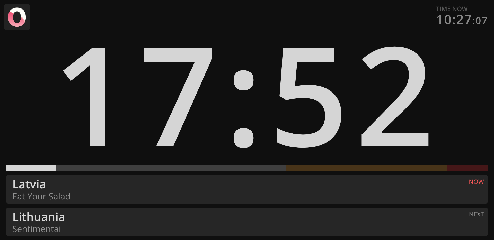

```bash title="Stage / Presenter timer"
https://MY-IP-ADDRESS:4001/timer           
```

This is probably what you came here for.

The typical screen used onstage, it displays a running timer for the current speaker. \
It also contains information on current and next events.



The timer view is able to show a secondary piece of data under the running clock. \
This can be the [Auxiliary Timer](/features/aux-timer), or the [External Message](/features/external-message).

These features are useful to give extra information to the presenter, such as data from another software eg: video progress, or a countdown to another event.
