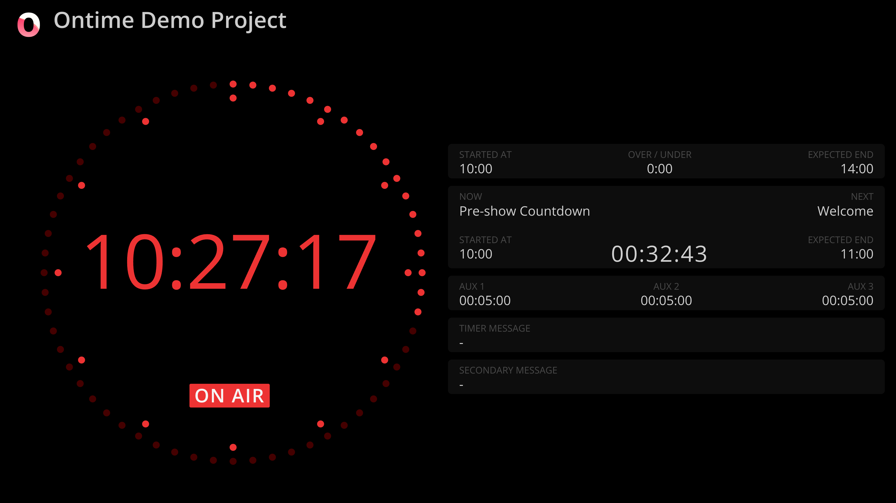

```bash title="Studio"
https://cloud.getontime.no/my-stage/studio           
```

Inspired by a master clock, the <mark>Studio</mark> view displays current time along with an overview of all running timers.


