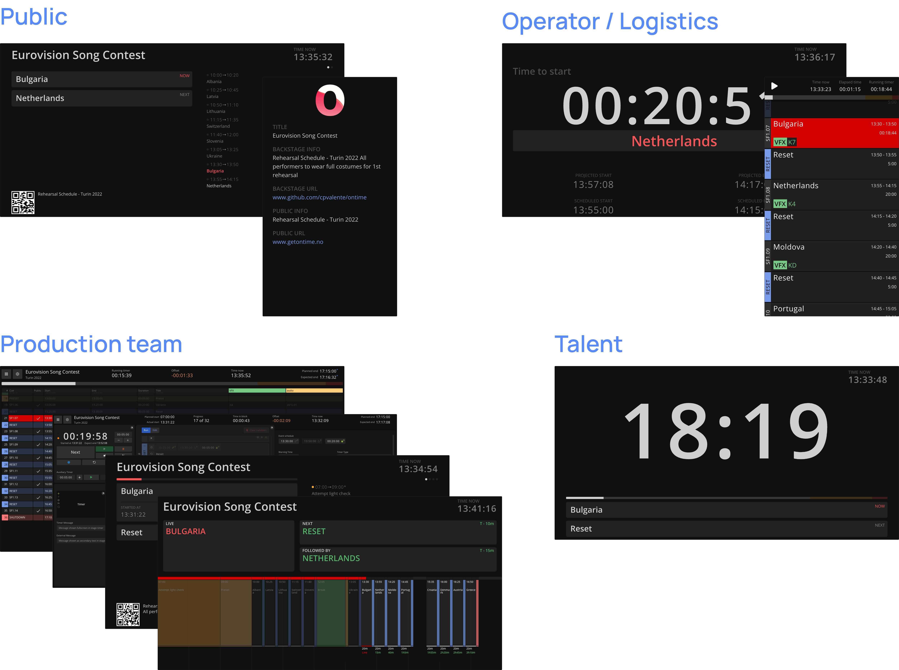

## Available views

Ontime offers different interfaces to consume and extend rundown data, these interfaces are designed to support different tasks:

- [Production views](#production-views): interactive views where users can edit the rundown and add information, focusing on detailed and collaborative work
- [Signage views](#signage-views): non-interactive displays that present key parts of the rundown in a clear, accessible way to support quick reference and coordination during the show.

Any device with a browser in the same network can access Ontime's views.

:::note
All views are configurable, allowing users to customise the behaviour and data of each interface. \
The configuration for signage views is saved in the URL for easy bookmarking and sharing.

[Read more](/quick-tips/configuring-views)
:::

### Production views

These refer to views which allow for data entry and are typically used by directors, show runners and operators.

| URL                                  | See the docs                               |
| :----------------------------------- | :----------------------------------------- |
| `http://MY-IP-ADDRESS:4001/editor`   | [Editor](/interface/production/app-editor) |
| `http://MY-IP-ADDRESS:4001/cuesheet` | [Cuesheet](/interface/production/cuesheet) |
| `http://MY-IP-ADDRESS:4001/op`       | [Operator](/interface/production/operator) |

### Signage views

Signage views are non-interactive interfaces focusing on display the rundown data at different levels of detail

#### Backstage data

| URL                                   | See the docs                                        |
| :------------------------------------ | :-------------------------------------------------- |
| `https//MY-IP-ADDRESS:4001/timer`     | [Timer](/interface/backstage/stage-timer)           |
| `http://MY-IP-ADDRESS:4001/minimal`   | [Minimal Timer](/interface/backstage/minimal-timer) |
| `http://MY-IP-ADDRESS:4001/clock`     | [Clock](/interface/backstage/clock)                 |
| `http://MY-IP-ADDRESS:4001/backstage` | [Backstage View](/interface/backstage/backstage)    |
| `http://MY-IP-ADDRESS:4001/countdown` | [Countdown](/interface/backstage/countdown)         |
| `http://MY-IP-ADDRESS:4001/studio`    | [Studio Clock](/interface/backstage/studio-clock)   |

A sub-section of these views focus on **public data**

#### Public data

| URL                                | See the docs                                    |
| :--------------------------------- | :---------------------------------------------- |
| `http://MY-IP-ADDRESS:4001/public` | [Public / Foyer View](/interface/public/public) |
| `http://MY-IP-ADDRESS:4001/lower`  | [Lower Thirds](/interface/public/lower-thirds)  |
