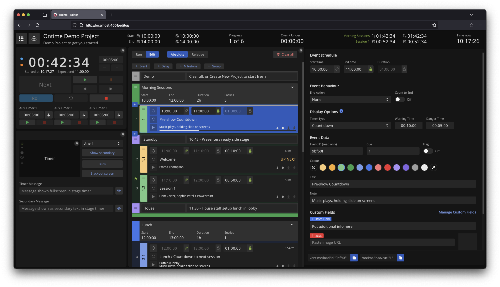

```bash title="Editor"
https://cloud.getontime.no/my-stage/editor           
```

The <mark>Editor</mark> view is the main application view.

Here you will setup and run your rundown, as well as have access to all the application settings.


