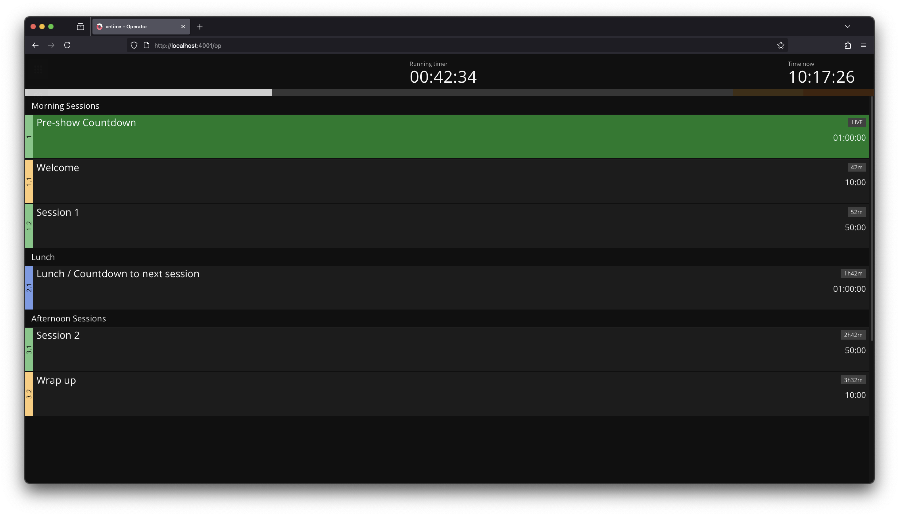

```bash title="Operator"
https://cloud.getontime.no/my-stage/op           
```

The <mark>Operator</mark> is designed for busy operators. \
The design focus on adapting to small devices (phones and tablets) and being as hands-off as possible.

The operator view automatically follows playback and also allows for data entry. \
You can customize an `Operator` view to show titles, notes, and/or a [custom field](/features/custom-fields) of your choice. This allows different operators to highlight the information that is most useful for them.


