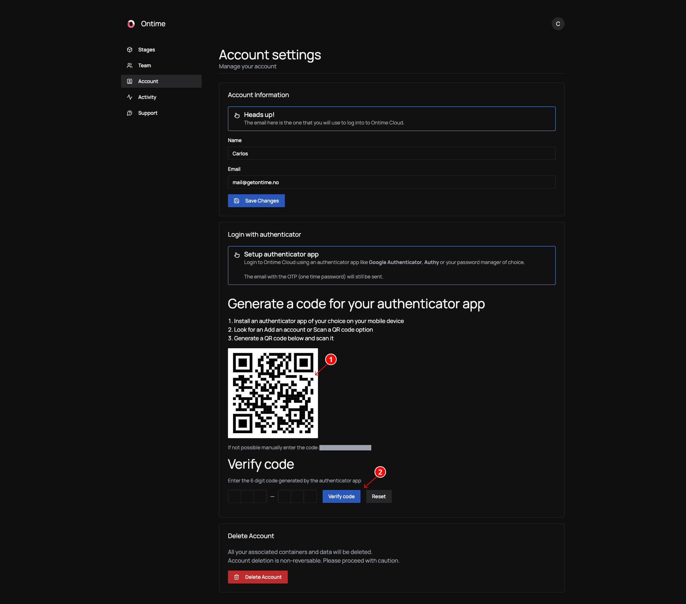

Ontime uses TOTP (Time-based One Time Password) to manage logins.

## Login with TOTP

Ontime Cloud users will leverage TOTP to log in and change their accounts. \
This provides a safe and convenient method for authentication, especially in accounts shared across multiple users.

To simplify this process, you can sync your Ontime Cloud account with an authenticator app (such as Authy, Google Authenticator or Password Manager). 

The process for syncing is straightforward. Once you are logged in and in the Accounts tab:
1. Scan the QR code generated using the chosen authenticator app
2. Verify the code generated by the app with Ontime

That's all!

From here, you can use the authenticator code in Ontime Cloud without depending on access to your email. \
The email with the code will still be sent.
