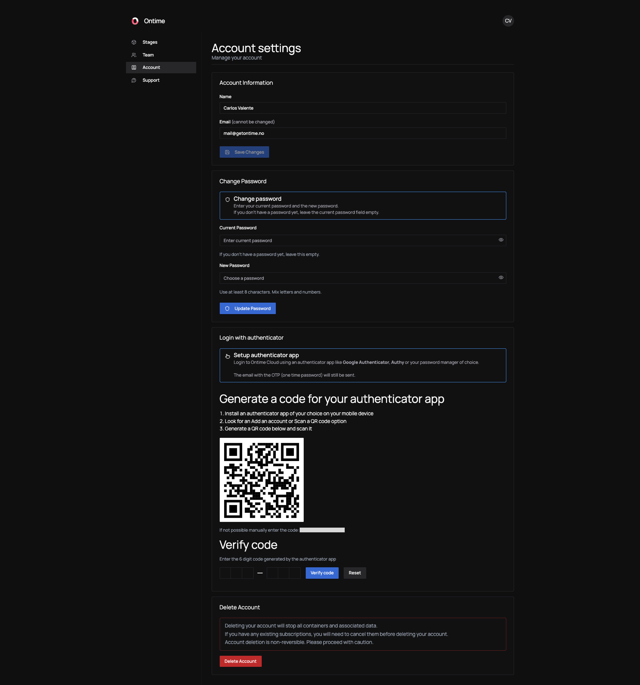

---
title: Manage your account
description: Manage Ontime Cloud account details, billing, subscription settings, and hosted production access.
---

After signing up for Ontime Cloud, you can access the app's dashboard to manage your stages, teams, and subscriptions.

## Manage your account

Every user can manage their own account, regardless of team role.

Here you will be able to:
- Update your profile details∂
- Set or change your password
- Link an authenticator app [see more in the tip](/ontime-cloud/tips/login-with-auth/)
- Delete your account

:::note
Early versions of Ontime Cloud supported only one-time passwords (OTP) for login.

If your account doesn’t have a password yet, you can set one now.
:::

### Delete your account
You can delete your account at any time.

If you are the team owner and your team has an active subscription, beware that you must cancel your subscription before deleting your account.

Deleting your account schedules the removal of your user and container data from Ontime's systems.
