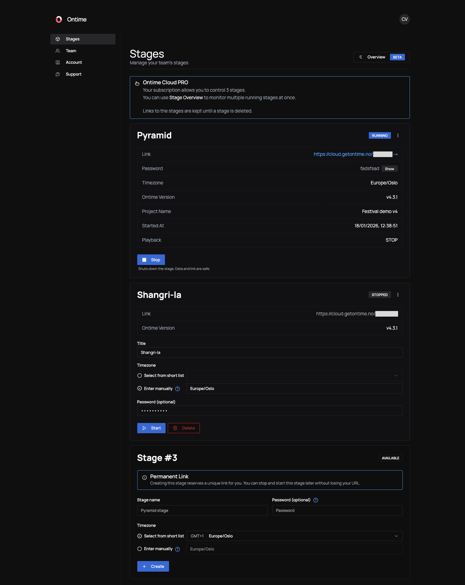

After signing up for Ontime Cloud, you can access the app's dashboard to manage your stages, teams, and subscriptions.

## Manage your stages

With the Ontime Cloud PRO subscription, you are currently allowed to manage three concurrent stages. \
Each stage is a separate version of Ontime. The stages can be started and stopped at any time.

Once a stage is started, Ontime will generate a permanent link that is unique for that stage. \
This link is public, and anyone with access to this link will be able to access your Ontime stage.

The link stays reserved while the stage exists, even when it is stopped, so you can safely shut it down between sessions and restart it later without losing the URL.\
When you are done with the project you can delete the stage to release the link, this will make sure you generate a new one the next time you start the stage.

:::note[Ontime version]
When a stage is created, it runs the latest available version of Ontime.

To ensure stability and prevent unexpected disruptions, the stage does not update automatically. \
You can update a running stage by stopping it and running the `Upgrade version` action.

There is no data loss while the stage is stopped but the link will be temporarily unavailable.
:::

### Stage lifecycle actions
- **Start** – Creates a stage with the latest version of Ontime and reserves a public link.
- **Stop** – Makes the link temporarily unavailable. You can stop a stage to modify options, upgrade a stage or simply to make a stage not accessible for a period of time without losing its data. Stopping a stage does not lose any data inside the stage.
- **Delete** – Permanently deletes the public link and the stage data. This is not reversible.

### Timezone
You can assign unique timezones for each stage.

We provide a small list of unique world timezones in the dropdown menu. \
Alternatively, you can add choose any IANA timezone (eg. "Europe/Oslo").\
See a list of timezones in [wikipedia](https://en.wikipedia.org/wiki/List_of_tz_database_time_zones).

### Password
In Ontime you can add a simple layer of protecting to production screens (eg. Editor, Operator and Cuesheet) with a pin code.

For extra access control, you can also define in Ontime Cloud dashboard a password for the stage.

If no password is provided, anyone with the link can access your stage. \
To change the password, you will need to stop and restart the stage.
