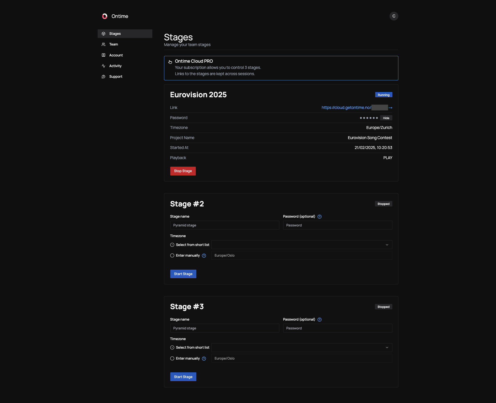

After signing up for Ontime Cloud, you can access the app's dashboard to manage your stages, teams, and subscriptions.

## Manage your stages

With the Ontime Cloud PRO subscription, you are currently allowed to manage three concurrent stages. \
Each stage is a separate version of Ontime. The stages can be started and stopped at any time.

Once a stage is running, Ontime will generate a link which is unique for every stage. \
This link is public, and anyone with access to this link will be able to access your ontime stage.

:::note[Ontime version]
When a stage is started, it runs the latest available version of Ontime.

To ensure stability and prevent unexpected disruptions, the stage does not update automatically.
If you need to use a newer version of Ontime, you must close and restart the stage.
:::

### Timezone
You can assign unique timezones for each stage.

We provide a small list of unique world timezones in the dropdown menu. \
Alternatively, you can add choose any IANA timezone (eg. "Europe/Oslo").\
See a list of timezones in [wikipedia](https://en.wikipedia.org/wiki/List_of_tz_database_time_zones).

### Password
In Ontime you can add a simple layer of protecting to production screens (eg. Editor, Operator and Cuesheet) with a pin code.

For extra access control, you can also define in Ontime Cloud dashboard a password for the stage.

If no password is provided, anyone with the link can access your stage.
To change the password, you will need to restart the stage.
