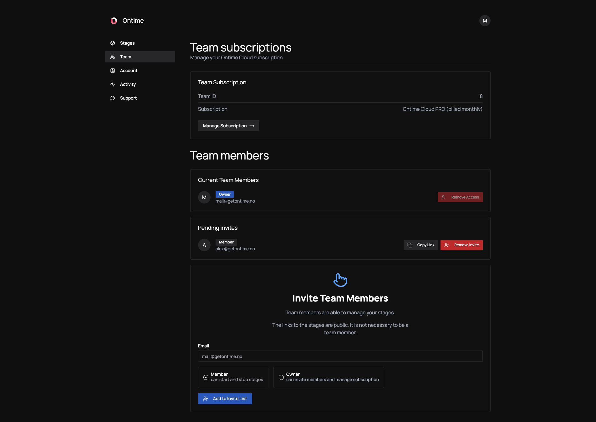

After signing up for Ontime Cloud, you can access the app's dashboard to manage your stages, teams, and subscriptions.

## Manage your team

Your Ontime subscription belongs to your team.

As the user who subscribed, you are the account owner, with access to account information and settings.

You can also invite others into your account, the invited users will have access to the same dashboard with subsets of permissions.

:::note
The links to the stages are public.
You do not need to add people to your team for them to have access to the stage.

The team invites should be reserved for people who you want to be able to manage the account and stages.
:::

### Account types
Ontime Cloud currently has two account types:

- **Member** - Members can manage (start and stop) your stages. \
This is the account type you will likely want to give to the technicians in your team.
- **Owner** - Owners can access all interface parts, including managing the subscription and deleting your account. \
Owners are also able to invite people to the team.

### Manage subscription
Ontime Cloud PRO is a monthly subscription product.

We use Stripe for subscription and payment infrastructure. \
By navigating to the `Team` tab and clicking the `Manage subscription` button you will have access to a page where you can:
- Update / change your payment method
- Update / change your payment information
- Download your previous payment receipts
- Cancel your subscription

:::note[Cancel subscription]
You can cancel your subscription of Ontime at any time. \
The cancellation will take effect at the end of the current billing cycle.

You will still maintain your subscription level and all its features during this period.
:::
