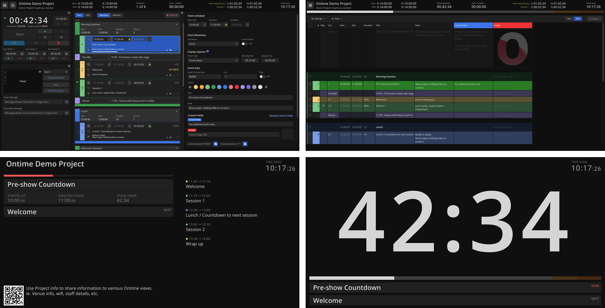

import { Card, CardGrid } from "@astrojs/starlight/components";

## Free open-source software for managing <mark>rundowns</mark> and <mark>event timers</mark>

:::tip[What is Ontime]

Ontime is a browser-based application that manages rundowns, scheduling, and cueing. \
It supports live productions, broadcasts, and events with real-time collaboration and powerful integrations.

Ontime streamlines your production workflow by enabling real-time collaboration, managing last-minute changes, and ensuring smooth communication.

You can run Ontime anywhere: \
Install it in your machine, run it in a production network or in the cloud.

Checkout our website to find out more [www.getontime.no](https://www.getontime.no)
:::

<CardGrid stagger>
  <Card title="Multiplatform" icon="approve-check">
    Available for Windows, MacOS, and Linux. You can also self host the
    docker image in your own server.
  </Card>
  <Card title="In any device" icon="approve-check">
    Ontime is accessible on any device with a web browser, including tablets,
    mobile phones, laptops, production signage, and media servers.{" "}
  </Card>
  <Card title="Delay workflows" icon="approve-check">
    Manage and communicate runtime delays in real-time to your entire production
    team.
  </Card>
  <Card title="Built for teamwork" icon="approve-check">
    Ontime offers real-time collaboration tools for various roles in your
    production team, including directors, operators, and backstage crew, without
    imposing any restrictions on the number of team members who can join a
    session.
  </Card>
  <Card title="Automatable" icon="approve-check">
    Ontime can be fully or partially controlled by an operator, or run
    standalone with the system clock for automated rundowns.
  </Card>
  <Card title="Focus on integrations" icon="approve-check">
    Use one of the APIs provided (OSC, HTTP, Websocket) or the available
    Companion module to integrate into your existing workflow (disguise, Qlab,
    OBS).
  </Card>
</CardGrid>

### Roadmap

Ontime is under active development. We continue adding and tweaking features in collaboration with users.

:::tip[Have an idea?]
Reach out via email at [mail@getontime.no](mailto:mail@getontime.no), [open an issue in GitHub](https://github.com/cpvalente/ontime/issues), join our [Discord server](https://discord.com/invite/eje3CSUEXm) or [Subreddit](https://www.reddit.com/r/ontimeapp/).
:::
