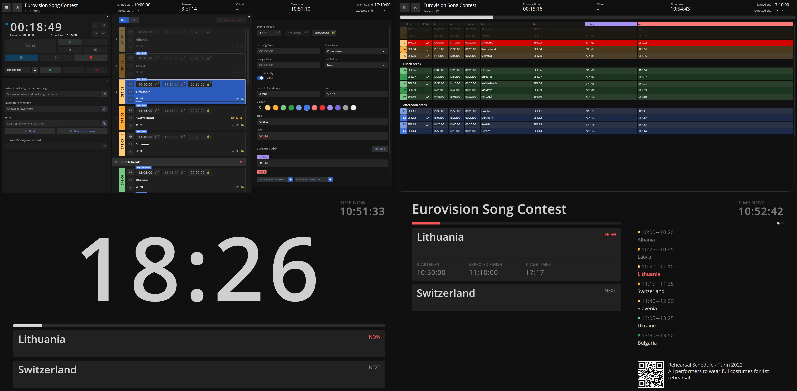
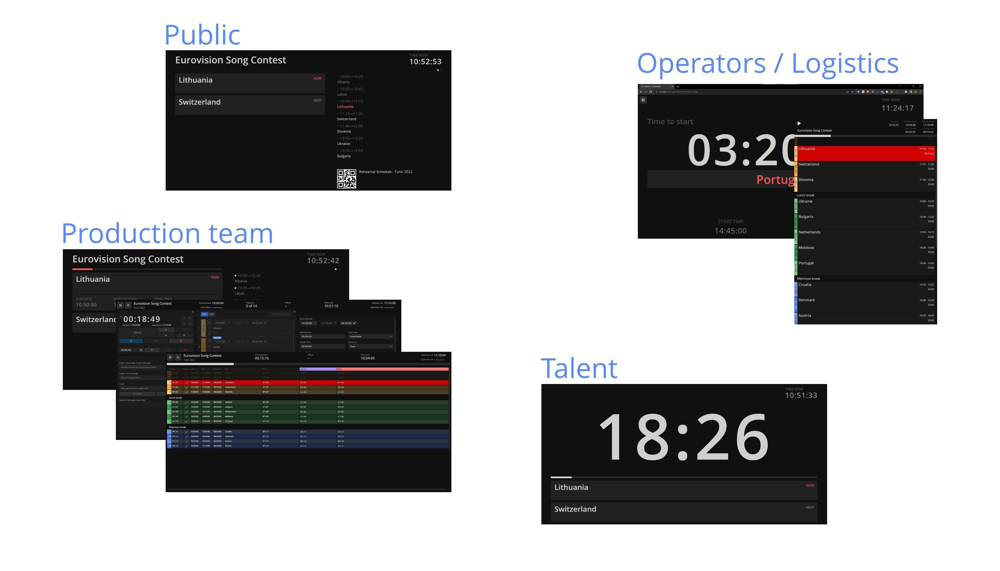

Ontime is an application for creating and managing event rundowns and timers.

:::tip[Multi Platform]
Ontime has available installers for Windows, macOS, Linux, and a Docker image. \
Follow [the website](https://www.getontime.no) for download links.
:::

### For live environments
Ontime is designed for use in live environments.
This guides the application into being flexible and efficiently integrating into different workflows.

### For teams
All information added in Ontime is shared with the production team and other software / hardware in your workflow.
Ontime also improves team collaboration with dedicated views for cuesheets and operators, and for public and production signage.

### Simple infrastructure
All the data is distributed over the network, making its distribution and infrastructure flexible and cheap.
With the availability of the docker image, you can also leverage IT infrastructure to make Ontime available online for your team and clients.

## Features
Ontime is an application for creating and managing event rundowns and event timers. \
See below what we consider are the core features:

##### ✓ Multiplatform
Available for Windows / MacOS, Linux. You can also self host with the docker image

##### ✓ In any device
Ontime is available in the local network to any device with a browser, eg: tablets, mobile phones, laptops, signage, media servers...

##### ✓ Made for teams
Ontime caters to different roles in your production team: directors, operators, backstage and front of house signage...

##### ✓ Delay workflows
Manage and communicate runtime delays in real-time to your team

##### ✓ Extendable
You can customise Ontime views and create your own

##### ✓ Automatable
Ontime can be fully or partially controlled by an operator, or run standalone with the system clock

##### ✓ Focus on integrations
Use one of the [APIs provided (OSC, HTTP, Websocket)](/api) or the available [Companion module](https://bitfocus.io/connections/getontime-ontime) to integrate into your workflow (disguise, Qlab, OBS)

## Roadmap

Ontime is under active development. We continue adding and tweaking features in collaboration with users.

:::tip[Have an idea?]
Reach out via email at [mail@getontime.no](mailto:mail@getontime.no) or [open an issue in GitHub](https://github.com/cpvalente/ontime/issues).
:::
