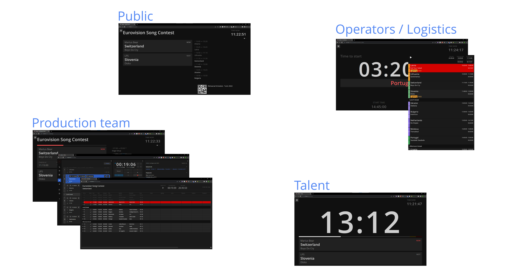

Ontime is an application for creating and managing event rundowns and timers.

It helps to organise and schedule a list of events and their information. The information is then distributed over the network and presented in different views.

Any device in the network with a browser can be a consumer of the views, making for an efficient way to distribute over a venue using a network infrastructure instead of video outputs.

:::tip[Multi Platform]
The app is available for Windows, macOS, Linux and as a Docker image. \
Follow [the website](https://www.getontime.no) for download links.
:::

## Unopinionated

We want Ontime to be unique by empowering freelancers.
Most freelancers work in different fields, and we want to give you a tool you can leverage across your many environments and workflows.

We are not interested in forcing workflows and have made Ontime so that it is flexible to whichever way you would like to work.
