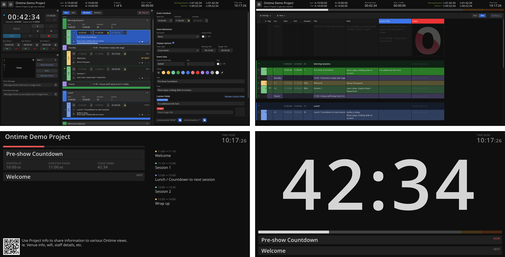

import { Card, CardGrid } from "@astrojs/starlight/components";

## The open-source rundown and run-of-show system for live productions

:::tip[What is Ontime]

Ontime is one live rundown that every department and display reads from — from planning through to show time.

Build and share the run of show, then use the same data for cueing, collaboration, timing, and integrations.

You can run Ontime anywhere: \
Install it on your machine, run it on a production network, or use Cloud when you do not want to run it yourself.

Checkout our website to find out more [www.getontime.no](https://www.getontime.no)
:::

[Learn how a rundown works](/concepts/rundown/) — events, groups, milestones, timing, and shared production data.

<CardGrid stagger>
  <Card title="Plan the show" icon="approve-check">
    Organise groups and milestones, roll up durations, and import your existing spreadsheet into the
    rundown.
  </Card>
  <Card title="Multiplatform" icon="approve-check">
    Available for Windows, MacOS, and Linux. You can also self host the Docker image on your own
    server.
  </Card>
  <Card title="In any device" icon="approve-check">
    Ontime is accessible on any device with a web browser, including tablets, mobile phones,
    laptops, production signage, and media servers.{" "}
  </Card>
  <Card title="Delay workflows" icon="approve-check">
    Manage and communicate runtime delays in real-time to your entire production team.
  </Card>
  <Card title="Built for teamwork" icon="approve-check">
    Ontime offers real-time collaboration tools for various roles in your production team, including
    directors, operators, and backstage crew, without imposing any restrictions on the number of
    team members who can join a session.
  </Card>
  <Card title="Automatable" icon="approve-check">
    Ontime can be fully or partially controlled by an operator, or run standalone with the system
    clock for automated rundowns.
  </Card>
  <Card title="Focus on integrations" icon="approve-check">
    Use one of the APIs provided (OSC, HTTP, Websocket) or the available Companion module to
    integrate into your existing workflow (disguise, Qlab, OBS).
  </Card>
</CardGrid>

### Roadmap

Ontime is under active development. We continue adding and tweaking features in collaboration with users.

:::tip[Have an idea?]
Reach out via email at [mail@getontime.no](mailto:mail@getontime.no), [open an issue in GitHub](https://github.com/cpvalente/ontime/issues), join our [Discord server](https://discord.com/invite/eje3CSUEXm) or [Subreddit](https://www.reddit.com/r/ontimeapp/).
:::
