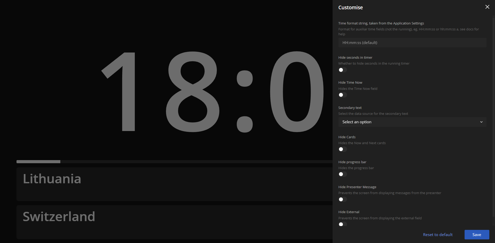

Most views are configurable using URL parameters. \
The only exceptions are the [editor](/interface/production/app-editor) and [cuesheet](/interface/production/cuesheet) views.

This means you can share a link which includes the complete customisation of a view. This feature pairs great with the [URL Presets feature](/features/url-presets).

You can open the customisation panel in any supported view via the View Parameters Editor (shown in the image) opened using the Settings button in the interface.

## Time formatting
By default all clocks in Ontime are in __24 hour format__, eg: `15:10:10`. \
In the __Application Settings__, you can change the default to a __12 hour format__, so it would be `03:10:10`.

In addition, some views will also allow configuring the format of the auxiliary times (ie: schedules and clocks). \
See below some common format strings. You can find more options for customisation in the formatting library documentation LINK.

| Format                | Result                                          | 
| :-------------------- | :---------------------------------------------- |
| `HH:mm:ss`            | `15:10:10`     (default for 24 hour format)     |
| `hh:mm:ss a`          | `03:10:10 PM`  (default for 12 hour format)     |
| `HH:mm`               | `15:10`                                         |
