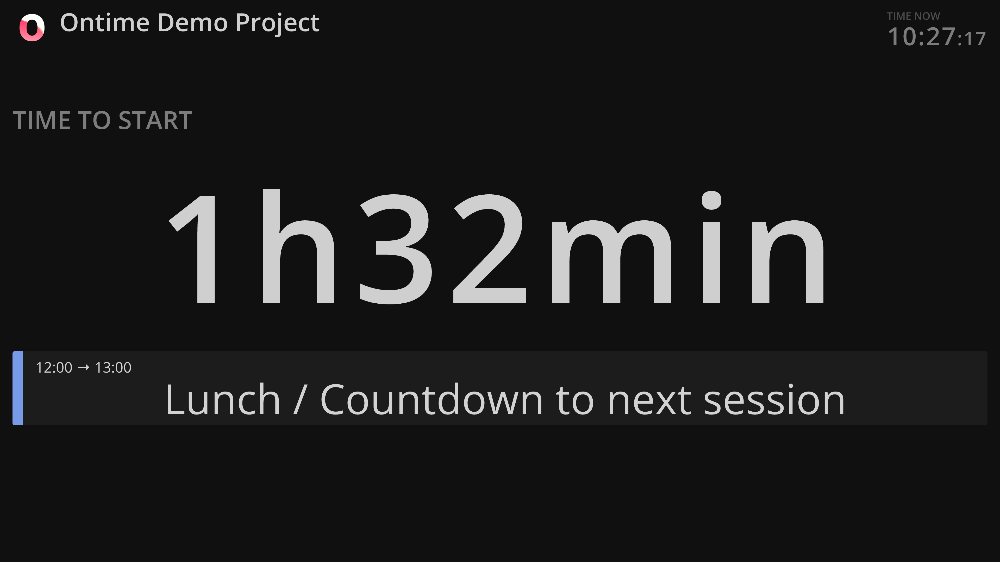
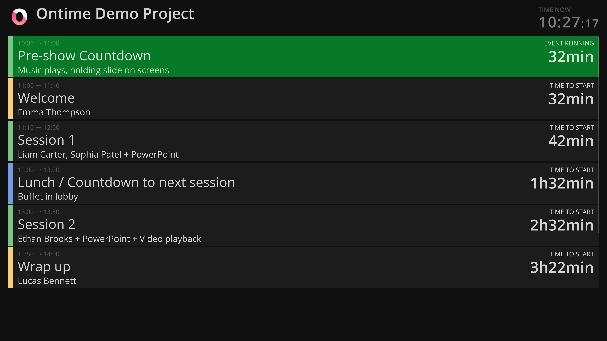

You can leverage the [countdown view](/interface/automated/countdown/) to have a screen that counts down to selection of events in the rundown.
 
This is useful for cases where you are interested in a specific event, ie, for the back-of-house staff who needs to track the time to break.

