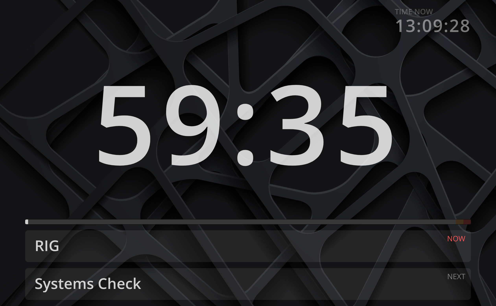

Ontime does not have built-in overrides for custom background images.

However, you can leverage [CSS overrides](/features/custom-styling) to achieve this. \
In rough terms you would need:
- include an image to be distributed with Ontime web view
- override CSS to display the image (as a background in this example)



In practice, there are a few more steps here. See step-by-step:

## 1. Add image to Ontime
You can leverage Ontime infrastructure to distribute an image. \
In this case, we would use that image as a background for our view. You will need:
a) find the location of the external folder in your Ontime installation
b) add your image to the folder

### Finding the location of the external folder
You will need to find out where the external folder of Ontime is; this location depends on both the operating system and installation.

**For PC users:**\
`AppData/Roaming/Ontime/external/`

**For Mac users:**\
`Library/Application Support/Ontime/external/`

**For Linux users:**\
`Home/Ontime/styles/external/`

As a shortcut, you can find the path to the CSS override file contained inside the external folder. You will also need this for the next step. \
The path to the CSS file is shown in the interface at `Editor` -> `Settings` -> `App settings` -> `View settings` where you activate the CSS override.

### Adding an image to the external folder
In this case, I have created a new folder inside `external` called `images` and added a file `bg.png`. 


## 2. Override CSS
To override the CSS, you will need two pieces of information:
a) the correct selector for the element you want to override
b) the location of the CSS file. See point above 

### Finding the selector
To get the CSS selector, you will need to inspect the page with your dev tools. \
Once you select the correct container element, you can right-click and choose `Copy` -> `Copy selector`. \

In my case `#root > div.App > div.stage-timer` was added to my clipboard.

### Implementing image as background
Apply the relevant CSS override with the selector from the previous step. In this example:

```
#root > div.App > div.stage-timer {
  background-image: url('/external/images/bg.png');
  background-size: cover;
}
```

Note: you may want to remove the other CSS overrides, or continue with more overrides to tweak colours as necessary.

### Activating CSS override
The last step necessary would be to activate the CSS override feature. \
To do so, navigate to the view settings. More information on the help page for [CSS overrides](/features/custom-styling).

From now on, navigating to the /timer view will show me the new background.
