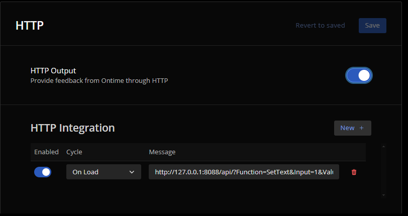
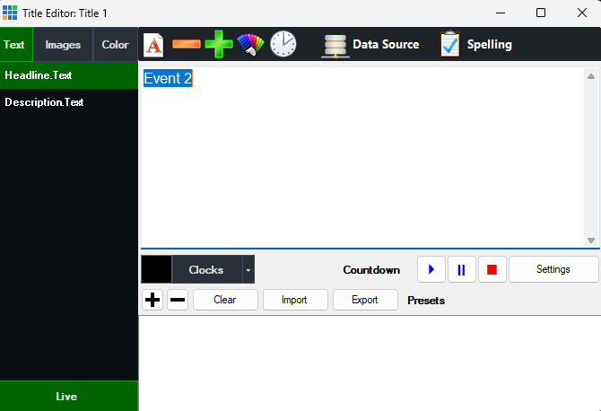
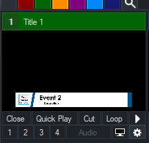

## Control Ontime from vMix
The most straightforward way to get Ontime synced with vMix is by using Ontime's [HTTP API](/api/protocols/http), which provides easy access to the apps playback functions.

Adapting from [this vMix forum post](https://forums.vmix.com/posts/t7079-http-command-midi), a workflow would look like:
- Go to `Settings` -> `Scripting` and click `Add`
- Paste the following and `Save`

```vb
' This code creates a GET request to Ontime for starting an event with id 4b044
Dim client = WebRequest.Create("http://<localhost:4001>/api/start/id/<4b044>")
Dim response = client.GetResponse()
```

:::note
If copying this code, remember to change `<localhost:4001>` to the IP address of the machine running Ontime and `<event-id>` to the relevant ID. You can find the ID in the Ontime interface.

More information on the endpoints available in the [documentation for the HTTP API](/api/protocols/http).
:::

From here, you should be able to add the script as needed. \
Please follow vMix documentation for the next steps.

## Control vMix from Ontime

You can leverage the [automation feature](/api/automation) to send HTTP data from Ontime to set parameters in vMix.

The example below will set a `Headline text` property to the title of the current event every time one is loaded.
- Navigate to the Integration Settings at `Editor` -> `Settings` -> `Automation`
- In "Manage automations" create a new automation and add an appropriate title
- Create an output of type HTTP and add the following URL:

```bash
http://127.0.0.1:8088/api/?Function=SetText&Input=Title%201&Value={{eventNow.title}}&SelectedName=Headline.Text
```

- In "Manage triggers" create a new trigger and add a title
- For the lifecycle trigger option select `On Load`
- For the Automation title option select the previously created automation

:::note
The request above sends variables from Ontime as described in the [automation documentation](/api/automation/#using-variables-in-automation).

Remember to modify the IP address and port as necessary.
:::




