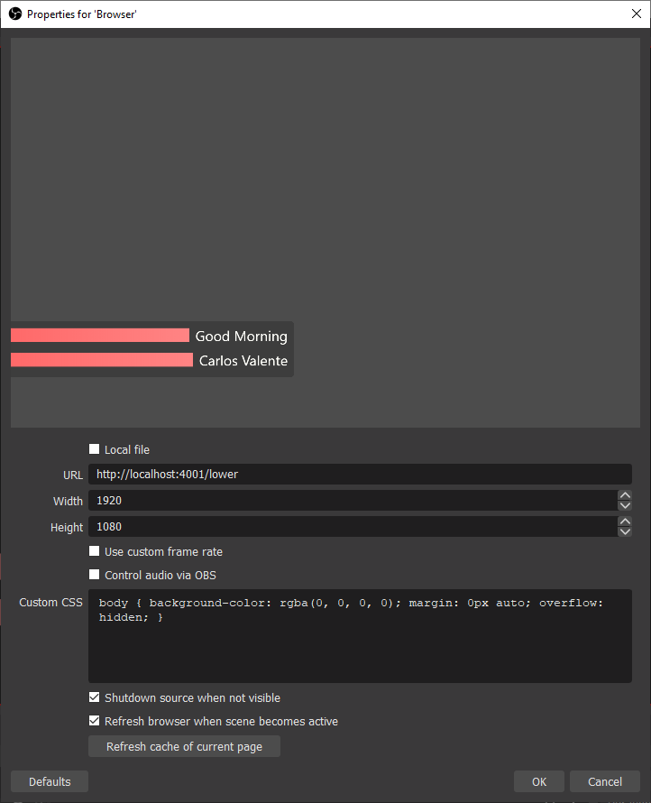

It is possible to render the lower thirds feature (or any Ontime view) in OBS in any networked machine using the **Browser Renderer**.



* [ ] The options **Shutdown source when not visible** and **Refresh browser when scene becomes active** ensure that the lower third animation play on load / unload
* [ ] Remember to clear the CSS to ensure a transparent background (see below)

```css
body { 
    background-color: rgba(0, 0, 0, 0); 
    margin: 0px auto; 
    overflow: hidden; 
}
```

:::note
This technique of rendering the browser in a video engine will be common to other devices and software such as disguise.
:::
