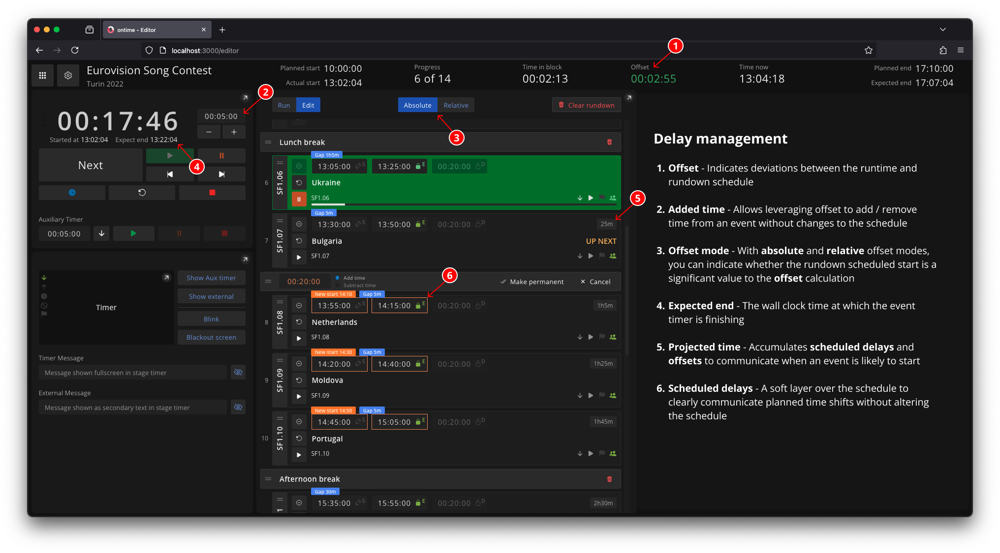

In live environments, things don’t always go exactly as scheduled. Events may start late, run long, or require timing adjustments. \
Ontime provides tools to communicate and manage these delays during production.

The key features for delay management are: 
- [Added time](#added-time) 
- [Projected time](#projected-time) 
- [Scheduled delays](#scheduled-delays)
- [Offsets](#offset)



## Added time

You can manually add or remove time from the currently running event, either from the editor view or via the API.

This is the simplest form of delay management
`Added time` adjusts the `offset` and `expected end` values, letting you extend or compress the active event without altering the rundown schedule.

## Projected time

`Projected time` combines `scheduled delays` and `offsets` to communicate the accumulated timing shifts during a show. \
i.e. based on the current trajectory, when are we expected to start any given event.

## Scheduled delays

`Scheduled delays` represent intentional timing adjustments in the rundown.

Unlike added time, `scheduled delays` are layered over the schedule without changing it. \
This allows the original timing to remain intact while clearly communicating a change to your team.

You can apply a `scheduled delay` permanently, making it part of the schedule. \
Once applied, Ontime no longer treats it as a schedule deviation.

:::note[Delay propagation]
`Scheduled delays` automatically propagate through the rundown. \
A delay will continue affecting downstream events until it finds a schedule gap large enough to absorb its value.
:::

## Offset

The `offset` indicates how far the current runtime has drifted from the original schedule and our capacity to finish the rundown on time.

Offsets can be positive (running early) or negative (running late).

:::note[In combination with count to end timers]
`Count to end` timers always count down to their scheduled end time, regardless of when they start. \
Their duration is dynamic, calculated from its `actual start` and `scheduled end`.

This makes them ideal for events with hard deadlines such as show start or crew cut off.
:::

### Absolute mode

Absolute mode is the default mode for `offset` calculation in Ontime.

It compares the current wall clock time to the rundown scheduled to show how far ahead or behind we are running.

#### Examples of Absolute offset calculation

:::tip[We start late and there are no gaps to recover]
In this case, the `offset` value will show a 10 minute `-00:10:00` deviation.

```
| Runtime                       | Result offset                 |
| ----------------------------- | ----------------------------- |
| Time Now: 09:10               | Scheduled start: 09:00        |
| Event A start time: 09:10     | Scheduled end: 10:00          |
| Rundown:                      | Actual start: 09:10           |
| - Event A 9:00 -> 10:00       | Expected end: 10:10           |
| - Event B 10:00 -> 11:00      | Offset: -00:10:00             |
```

:::

:::tip[We started late, but the event is count-to-end]
`Count to end` events always finish at their scheduled end, so no `offset` is generated ...

```
| Runtime                       | Result offset                 |
| ----------------------------- | ----------------------------- |
| Time Now: 09:10               | Scheduled start: 09:00        |
| Event A start time: 09:10     | Scheduled end: 10:00          |
| Rundown:                      | Actual start: 09:10           |
| - Event A                     | Expected end: 10:00           |
|   schedule: 9:00 -> 10:00     | Offset: 00:00:00              |
|   type: count-to-end          |                               |
| - Event B                     |                               |
|   schedule: 9:00 -> 10:00     |                               |
|   type: count-down            |                               |
```

... if a `count to end` event goes overtime, it generates an `offset` equal to this value.

```
| Runtime                       | Result offset                 |
| ----------------------------- | ----------------------------- |
| Time Now: 10:10               | Scheduled start: 09:00        |
| Event A start time: 09:10     | Scheduled end: 10:00          |
| Rundown:                      | Actual start: 09:10           |
| - Event A                     | Expected end: 10:10           |
|   schedule: 9:00 -> 10:00     | Offset: -00:10:00             |
|   type: time-to-end           |                               |
| - Event B                     |                               |
|   schedule: 9:00 -> 10:00     |                               |
|   type: count-down            |                               |
```

:::

### Relative mode

Relative mode calculates `offset` based on when the rundown actually started, ignoring the rundown scheduled start.

This mode is useful when the exact start time is not relevant (eg: during rehearsals, recordings, or pre-show prep) but we still want to keep track of time drifts during the runtime.

:::tip[Starting from 00:00:00]
Some users will want to start their rundown at `00:00:00`. Either to represent a midnight show start or to indicate that the wall clock schedule is not relevant.

In **absolute mode**, Ontime treats `00:00:00` as a literal midnight reference. \
This causes an immediate `offset` based on the difference between the current time and midnight.

Relative mode normalises all `offset` calculations to the actual start time of the rundown. \
This allows `00:00:00` to be a neutral baseline and avoid producing an initial `offset`.
:::
