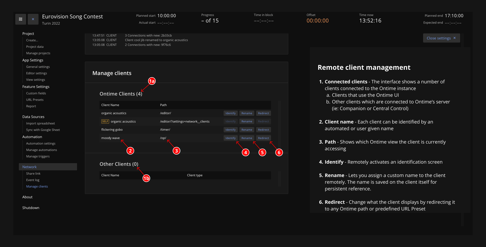

In a live production environment, Ontime will have multiple connections to its server.
- Operators reading their cues
- Confidence monitors onstage
- Public schedules displayed in the foyer
- Automation systems like Companion or Central Control

It is sometimes desirable to be able to modify what is shown to the clients from a central place in Ontime's interface. \
This is especially the case in devices with no input (such as PA displays), but also for productions where we prefer having tight control over the system setup.

To support this workflow, Ontime provides two key features:

### URL Presets
Create easy to remember links that point to specific views in Ontime. \
This makes it simple to set up and share configurations, like a custom view for a camera operator or sound engineer. \
[See the feature documentation](/features/url-presets).

### Remote client management

This interface gathers tools to let you manage connections to Ontime's server
- Monitor all active connections to Ontime
- Discover and identify clients
- Assign descriptive names for easy reference
- Redirect any client to a different interface or preset remotely

