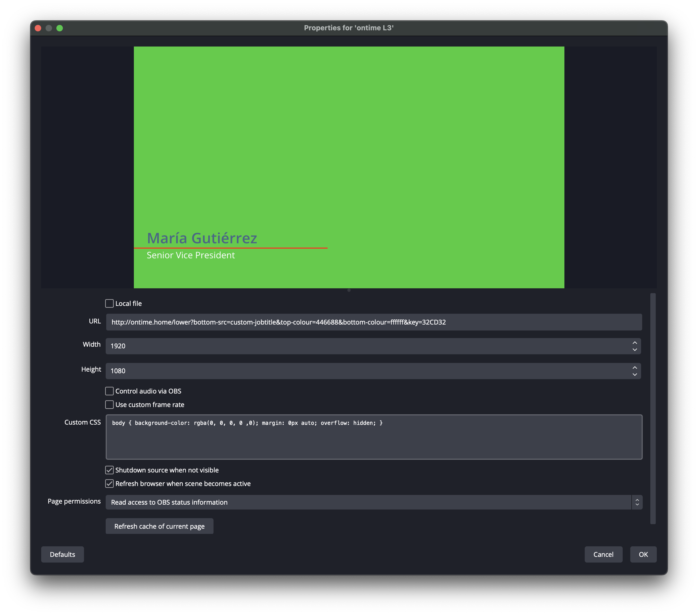

It is possible to render Ontime output views on any computer that can access Ontime over the network. \
Aside from a web browser, you can do this using any third-party software that can render an HTML page, such as OBS (Open Broadcaster Software), disguise or Touchdesigner.

:::note[Background colors, keying, and transparency]
Several Ontime views (e.g., the Minimal Timer and Lower Third views) offer a customizable background colour—including transparency—via the `key` parameter.\
See [view configuration](/quick-tips/configuring-views).

For views that do not explicitly offer a customizable `key` color, you can customize the background (or other) colors by overriding [CSS variables](/features/custom-styling) using code such as:

```css
:root {
    --background-color-override: #00FF00;
}
```
:::

## Rendering lower thirds in OBS


* The options **Shutdown source when not visible** and **Refresh browser when scene becomes active** ensure that the lower third animation play on load / unload
* Remember to set a keyable / transparent background color using the `key` parameter or custom CSS (see above)
