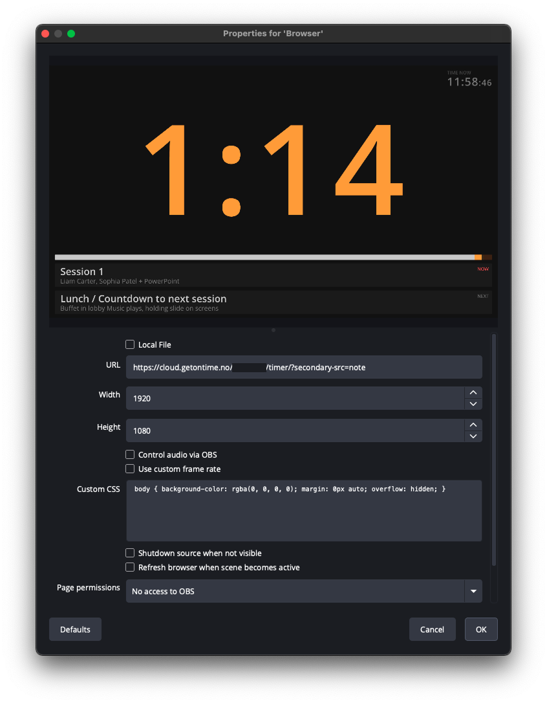

It is possible to render Ontime output views on any computer that can access Ontime over the network. \
Aside from a web browser, you can do this using any third-party software that can render an HTML page, such as OBS, vMix, disguise or Touchdesigner.

:::note[Background colours, keying, and transparency]
The `timer` view offer a customizable background colour — including transparency — via the `key` option.\
See [view configuration](/quick-tips/configuring-views).

For views that do not explicitly offer a customizable `key` colour, you can customize the background (or other) colours by overriding [CSS variables](/features/custom-styling) using code such as:

```css
:root {
  --background-color-override: #00ff00;
}
```
:::

### Example: Rendering a confidence monitor in OBS



You may need to distribute our timer view as a confidence monitor through your system, or consume it in a multiview.

In OBS you can use the Browser source. You would simply need to provide OBS with the link to the page with the options you need.

:::note[Ontime Cloud password]
For users running Ontime< from a password protected stage in Ontime Cloud, you wil need to create a link that contains authentication.

You can achieve this by

1. Navigate to the `Editor` -> `Settings` -> `Sharing and reporting` -> `Share link`
2. Select your target view or preset, and activate the `Authenticate toggle`
3. Click the `Create share link` button and provide the link copied to your clipboard to OBS
   :::

### Rendering issues

We try to keep our compatibility targets as wide as possible. \
However some software uses older browser versions and may not be able to render Ontime's views.
In those cases you will often see a blank page.

[Custom views](/features/custom-views) may be a good alternative here. \
With custom views you can leverage Ontime's data and distribution to make a simple page that could have a wider browser support.
